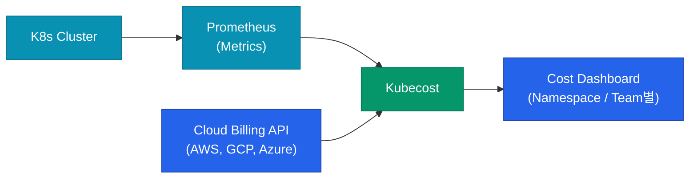

가상 머신(EC2) 시대에는 "누가 얼마를 썼는지"가 명확했습니다. 인스턴스 하나가 특정 부서 소유였으니까요. 하지만 Kubernetes는 여러 서비스가 노드 리소스를 공유하여 사용하므로 비용 계산이 매우 복잡해집니다. 공유 클러스터 환경에서 비용의 주인을 찾고 효율성을 높이는 기법들을 정리해요.

## 비용 가시성 확보: Kubecost

Kubernetes 내에서 "어떤 네임스페이스가 CPU를 얼마나 점유했는가"를 돈으로 환산해주는 도구가 필요합니다. **Kubecost**(또는 오픈소스인 OpenCost)가 표준으로 쓰입니다.

Kubecost는 실제 클라우드 청구 데이터와 실시간 리소스 사용량을 결합하여, **네임스페이스(Namespace)**나 **라벨(Label)** 단위로 아주 상세한 비용 리포트를 제공합니다.

## 효율적인 스케일링: Karpenter

기본 Cluster Autoscaler는 노드 그룹(ASG) 단위로 작동하여 유연성이 떨어집니다. **Karpenter**는 Pod의 요구사항(CPU, GPU, Arch 등)을 직접 보고 최적의 노드를 실시간으로 선택해 띄웁니다.

- **Bin-packing**: 여러 개의 작은 노드 대신 큰 노드 하나에 Pod를 몰아넣어(Consolidation) 전체 비용을 절감합니다.
- **Spot First**: 가능하다면 항상 저렴한 스팟 인스턴스를 우선적으로 선택하도록 정책을 세울 수 있습니다.
- **Node Termination**: 더 이상 필요 없는 노드를 즉시 반납하여 낭비를 최소화합니다.

## 비용 최적화의 핵심: Requests vs Limits

Kubernetes 비용의 대부분은 **Resource Requests**(예약량)를 기준으로 계산됩니다. 실제 사용량이 적더라도 Requests를 크게 잡아두면, 그만큼의 노드 비용은 지불해야 합니다.

| 상황 | 영향 | 비용 관점 |
|---|---|---|
| **High Requests** | Pod는 안정적이지만 노드 낭비 심함 | **비용 증가** |
| **Low Requests** | 노드 효율은 좋지만 Pod 실행 보장 안 됨 | **안정성 위험** |

  
핵심 인사이트: 유휴 자원(Idle)도 비용입니다

  아무도 쓰지 않는 빈 공간도 결국 회사가 지불하는 비용입니다. Kubecost를 통해 <b>Idle 리소스의 비율</b>을 확인하고, VPA(Vertical Pod Autoscaler)를 활용해 Requests 값을 실제 사용량에 가깝게 튜닝하는 과정이 반드시 병행되어야 합니다.

## 실전 비용 배분 패턴

1. **Namespace 기반**: 부서/팀별로 네임스페이스를 분리하여 비용을 1차 배분합니다.
2. **Label 기반**: `team: marketing`, `app: data-pipeline`과 같은 라벨로 공통 인프라(DB 등)의 비용을 쪼갭니다.
3. **Shared Cost 처리**: 컨트롤 플레인이나 로깅 시스템 같은 공통 비용은 각 팀의 사용량 비율에 맞춰 나눕니다.

## 정리

- **Kubecost**를 통해 블랙박스였던 클러스터 비용을 투명하게 공개합니다.
- **Karpenter**를 도입하여 노드 프로비저닝을 최적화하고 유휴 자원을 줄입니다.
- **Requests** 설정을 실제 사용량에 맞춰 최적화하는 것이 비용 절감의 지름길입니다.
- 비용 데이터를 정기적으로 팀원들과 공유하여 **비용 중심의 개발 문화**를 만듭니다.

Cost Optimization 시리즈를 통해 구름 너머 보이지 않던 비용을 관리하는 실전 기법들을 살펴보았습니다. 효율적인 인프라는 단순히 기술적으로 뛰어난 인프라가 아니라, 비즈니스 가치를 가장 경제적으로 실현하는 인프라입니다.
