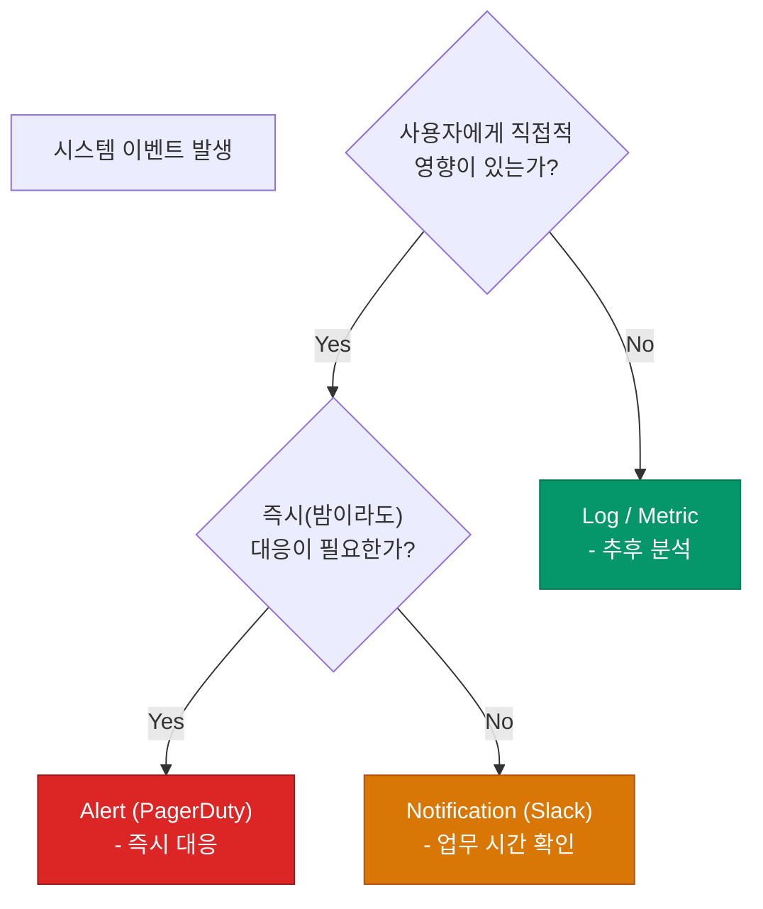

시스템을 운영하다 보면 예상치 못한 장애는 반드시 발생합니다. 이때 누군가는 즉시 대응해야 하는데, 이 역할을 맡는 것이 바로 **온콜**(On-call)입니다. 하지만 24시간 쏟아지는 알람에 시달리다 보면 팀의 생산성은 급격히 떨어집니다. 지속 가능한 운영을 위해 온콜 로테이션과 효율적인 알람 체계를 구축하는 방법을 정리해요

## 온콜 로테이션 패턴

온콜은 특정 개인에게 부담이 집중되지 않도록 팀원들이 돌아가며 맡아야 합니다

| 패턴 | 설명 | 특징 |
|---|---|---|
| **Weekly Rotation** | 한 사람이 일주일 동안 24시간 대응 | 소규모 팀에서 흔히 사용, 야간 대응 부담 큼 |
| **Primary/Secondary** | 주 대응자와 보조 대응자를 동시에 지정 | 주 대응자 부재 시 백업 가능, 안정성 높음 |
| **Follow-the-Sun** | 가령 한국팀은 낮에, 미국팀은 밤(미국 낮)에 대응 | 글로벌 팀에서 이상적, 야간 근무 최소화 |

## 알람 vs 알림: 신호와 소음 구분하기

모든 이벤트에 알람을 울리면 정작 중요한 장애 신호를 놓치게 됩니다. 이를 구분하는 명확한 기준이 필요합니다

- **Alert**: 즉시 조치를 취하지 않으면 서비스가 중단되는 상황입니다. (예: 5xx 에러 급증, DB 다운)
- **Notification**: 인지는 해야 하지만, 다음날 업무 시간에 확인해도 되는 정보성 메시지입니다. (예: 배포 완료, 디스크 80% 점유)

## 에스컬레이션 정책 (Escalation Policy)

주 대응자가 알람을 확인하지 못할 경우를 대비해 자동으로 다음 사람에게 전달되는 체계가 필요합니다

1. **Level 1**: 주 온콜 담당자에게 푸시/문자 발송
2. **Level 2**: 5~15분 내 미확인 시 보조 담당자에게 발송
3. **Level 3**: 여전히 미확인 시 팀장 또는 유관 부서 전체 발송

  
핵심 인사이트: 온콜 피로(Burnout) 방지

  알람 소리가 들릴 때 심장이 뛰거나 불안감을 느낀다면 이미 <b>온콜 피로</b>가 쌓인 것입니다. 알람의 개수를 줄이는 것보다 '대응할 필요가 없는 알람'을 제거하는 것이 훨씬 중요합니다. "이 알람이 울렸을 때 내가 할 수 있는 행동이 있는가?"를 자문해 보세요

## 정리

- **온콜**은 공평하고 예측 가능한 로테이션을 통해 운영됩니다
- **신호**(Alert)와 **소음**(Notification)을 엄격히 구분하여 피로도를 낮춥니다
- **에스컬레이션**을 통해 장애 대응의 사각지대를 없앱니다
- 지속적인 알람 튜닝을 통해 '양보다 질' 중심의 감시 체계를 만듭니다

다음 글에서는 실제 장애가 발생했을 때 혼돈을 줄이고 조직적으로 대응하는 **장애 대응 플레이북**에 대해 알아봐요
