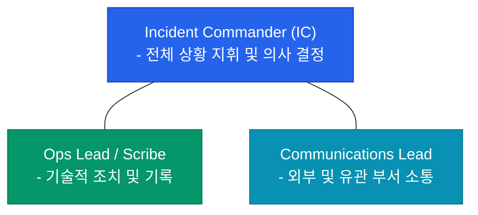

장애 알람이 울리는 순간, 아무런 준비가 되어 있지 않다면 현장은 순식간에 아수라장이 됩니다. 누가 상황을 지휘할지, 누구에게 알려야 할지 몰라 우왕좌왕하는 사이 장애 시간은 길어지죠. **장애 대응 플레이북**(Incident Response Playbook)은 이러한 혼돈을 방지하기 위해 사전에 약속된 행동 지침입니다

## 장애 심각도 분류 (Severity)

모든 장애에 똑같은 에너지를 쏟을 수는 없습니다. 영향도에 따라 등급을 나누고 대응 수준을 결정합니다

| 등급 | 영향 범위 | 대응 수준 |
|---|---|---|
| **P0 / SEV1** | 서비스 전체 중단, 결제 불가 등 치명적 영향 | 즉시 소집, 전사 공지, 야간/휴일 불문 |
| **P1 / SEV2** | 주요 기능 일부 마비, 다수 사용자 불편 | 즉시 대응, 관련 팀 협업 |
| **P2 / SEV3** | 성능 저하, 마이너한 기능 오류 | 업무 시간 내 대응 |
| **P3 / SEV4** | 단순 버그, UI 깨짐 등 | 백로그 등록 후 순차 처리 |

## 대응 역할 분담: ICS 모델

장애 상황에서는 '누가 무엇을 할지'가 명확해야 합니다. 보통 **ICS**(Incident Command System) 모델을 변형하여 사용합니다

- **Incident Commander (IC)**: 현장의 사령관입니다. 문제를 직접 해결하기보다, 전체적인 가용 자원을 배분하고 기술적 판단을 최종 승인합니다
- **Ops Lead**: 실제 인프라나 코드를 수정하는 엔지니어입니다
- **Communications Lead**: 고객 지원팀(CS)이나 경영진에게 현재 상황과 예상 복구 시간을 공유합니다

## 구조화된 커뮤니케이션

장애 대응을 위한 전용 공간이 필요합니다

1. **War-room**: 슬랙(Slack)의 `#incident-2024-04-20`과 같이 장애 전용 채널을 생성합니다
2. **Status Page**: 고객들에게 장애 사실을 투명하게 알립니다. "문제를 인지했고 해결 중입니다"라는 메시지만으로도 고객의 불안을 크게 줄일 수 있습니다
3. **Scribe**: 대응 과정에서 내린 결정과 실행한 명령을 실시간으로 기록합니다. 이는 추후 포스트모템의 귀중한 자료가 됩니다

  
핵심 인사이트: ChatOps의 활용

  슬랙 채널에서 <code>/incident help</code>와 같은 명령어로 즉시 워룸을 만들고, 담당자를 호출하고, 현재 상태를 대시보드에 업데이트하는 <b>ChatOps</b>를 구축해 보세요. 상황 전파 속도가 비약적으로 빨라집니다

## 정리

- 장애 등급(**Severity**)을 나누어 대응의 우선순위를 정합니다
- **IC, Ops, Comms**로 역할을 분담하여 지휘 체계를 일원화합니다
- 전용 **커뮤니케이션 채널**을 통해 정보를 투명하게 공유합니다
- 대응 과정의 모든 기록은 자동화하거나 실시간으로 남겨야 합니다

다음 글에서는 장애가 종료된 후, 같은 실수를 반복하지 않기 위해 조직적으로 학습하는 **포스트모템과 학습**에 대해 알아봐요
