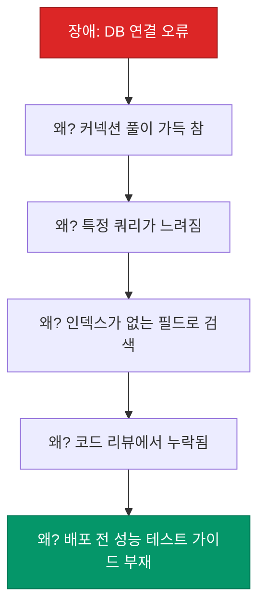

장애가 해결되었다고 상황이 끝난 것은 아닙니다. 진정한 마무리는 "왜 이런 일이 발생했는가"를 분석하고 "다시는 같은 실수를 반복하지 않기 위한 대책"을 세우는 것입니다. 이를 **포스트모템**(Post-mortem) 또는 사후 분석이라고 부릅니다. 장애를 단순한 불운이 아닌, 시스템을 개선할 수 있는 가장 값진 **학습 자산**으로 바꾸는 방법을 정리해요.

## 비난 없는 포스트모템 (Blameless)

가장 중요한 대원칙은 **"누구의 잘못인가"를 따지지 않는 것**입니다.

| 구분 | 비난 중심 (Blame) | 비난 없는 (Blameless) |
|---|---|---|
| **조사 방향** | 실수를 저지른 사람 찾기 | 실수를 유발한 시스템 결함 찾기 |
| **분위기** | 방어적, 은폐 유발 | 투명함, 솔직한 공유 |
| **결과** | 개인 징계, 사기 저하 | 시스템 보완, 재발 방지 |

엔지니어는 자신이 한 실수를 솔직하게 공유할 수 있어야 합니다. 그래야만 문제의 진짜 원인을 찾고 시스템적으로 방어막을 구축할 수 있습니다.

## 5 Whys와 시스템 사고

원인을 분석할 때 흔히 쓰이는 기법이 **5 Whys**입니다. 하지만 단순히 '왜'를 반복하는 것을 넘어, **시스템 전체의 맥락**을 봐야 합니다.

"개발자가 인덱스를 안 만들어서"에서 멈추면 안 됩니다. "인덱스가 없는 쿼리가 배포될 수 있는 시스템적 허점"을 찾아내어, 린트(Lint) 도구를 도입하거나 성능 테스트를 자동화하는 대책을 세워야 합니다.

## 실행 가능한 대책 (Action Items)

분석의 결과는 반드시 **실행 가능한 작업**으로 이어져야 합니다.

1. **Short-term**: 임시 조치 (예: 메모리 증설)
2. **Medium-term**: 시스템 보완 (예: 타임아웃 설정 추가, 알람 임계치 튜닝)
3. **Long-term**: 구조적 개선 (예: DB 샤딩, 아키텍처 변경)

모든 액션 아이템은 담당자와 기한이 정해져야 하며, 일반적인 개발 백로그와 동일한 우선순위로 관리되어야 합니다.

  
핵심 인사이트: 학습하는 조직의 문화

  포스트모템 문서는 전사에 공개되는 것이 좋습니다. 다른 팀의 장애를 보며 "우리 시스템에도 비슷한 구멍이 있지 않을까?"라고 자문할 수 있는 기회를 주기 때문입니다. 장애를 숨기는 조직은 도태되지만, 장애를 공유하는 조직은 갈수록 단단해집니다.

## 정리

- 포스트모템은 사람을 벌하는 자리가 아니라 **시스템을 개선하는 자리**입니다.
- **Blameless** 문화를 기반으로 장애의 근본 원인을 깊이 있게 파헤칩니다.
- **시스템 사고**를 통해 개인의 실수를 방어할 수 있는 기술적 장치를 마련합니다.
- 도출된 **액션 아이템**을 추적하여 실질적인 변화를 만들어냅니다.

Incident Management 시리즈를 통해 장애를 대하는 성숙한 엔지니어링 문화를 살펴보았습니다. 완벽한 시스템은 없지만, 실패를 통해 끊임없이 배우는 조직은 완벽에 가까워질 수 있습니다.
