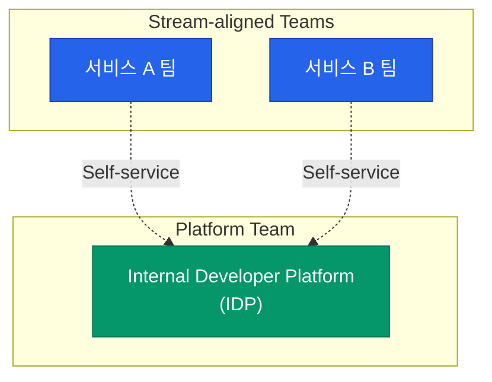

"개발자가 인프라도 다 알아야 한다"는 DevOps의 이상은 때로 개발자에게 과도한 **인지 부하**(Cognitive Load)를 주곤 합니다. 코드도 짜야 하는데 쿠버네티스 설정, 보안 스캔, 모니터링 구축까지 직접 챙겨야 한다면 개발 효율은 떨어질 수밖에 없죠. **플랫폼 엔지니어링**(Platform Engineering)은 이 문제를 해결하기 위해 등장한 개념입니다

## DevOps의 진화와 플랫폼 엔지니어링

플랫폼 엔지니어링은 DevOps를 대체하는 것이 아니라, DevOps가 실현되도록 돕는 **구현체**에 가깝습니다

| 단계 | 특징 | 문제점 |
|---|---|---|
| **Traditional Ops** | 개발팀과 운영팀의 엄격한 분리 | 소통 단절, 배포 병목 |
| **Early DevOps** | "You build it, you run it" | 개발자의 인지 부하 급증 |
| **Platform Eng** | 내부 개발자 플랫폼(IDP) 제공 | 개발자는 비즈니스에, 플랫폼팀은 기반에 집중 |

플랫폼팀은 개발자가 셀프 서비스로 인프라를 사용할 수 있는 환경을 구축하여, 운영 지식 없이도 안정적인 배포가 가능하게 만듭니다

## 팀 구조: Team Topologies

플랫폼 엔지니어링을 설명할 때 빠지지 않는 개념이 **팀 토폴로지**(Team Topologies)입니다. 조직의 팀들이 어떻게 협력해야 효율적인지 정의합니다

1. **Stream-aligned Team**: 실제 비즈니스 가치를 만드는 팀입니다. 플랫폼이 제공하는 도구를 사용하여 빠르게 기능을 출시합니다
2. **Platform Team**: 내부 플랫폼을 만들고 운영합니다. 스트림 정렬 팀이 겪는 공통적인 기술적 어려움을 해결해 줍니다

## 플랫폼을 제품처럼(Platform as a Product)

가장 중요한 철학은 **플랫폼을 하나의 제품**으로 대하는 것입니다. 사용자는 우리 회사의 동료 개발자입니다

- **사용자 경험(DX) 중심**: 문서화가 잘 되어 있고 사용하기 편리해야 합니다
- **피드백 루프**: 개발자들이 무엇을 불편해하는지 듣고 기능을 개선합니다
- **강제하지 않는 가이드**: 플랫폼 사용을 강요하기보다, 플랫폼을 쓰는 것이 훨씬 편해서 스스로 선택하도록 만들어야 합니다

  
핵심 인사이트: 인지 부하 줄이기

  플랫폼 엔지니어링의 최종 목표는 <b>개발자가 비즈니스 로직에만 집중할 수 있는 상태</b>를 만드는 것입니다. 쿠버네티스 YAML 파일을 직접 고치는 대신, 버튼 클릭 한 번이나 간단한 설정 파일 하나로 모든 것이 해결되는 '마법 같은 경험'을 제공하는 것이죠

## 내부 개발자 플랫폼(IDP)의 역할

플랫폼 엔지니어링의 결과물이 바로 **내부 개발자 플랫폼**(Internal Developer Platform, IDP)입니다. IDP는 다음과 같은 기능을 제공합니다

| 기능 | 설명 |
|---|---|
| **Self-service** | 티켓 처리 없이 개발자가 직접 인프라 생성 |
| **Infrastructure Orchestration** | 클라우드 자원의 자동화된 관리 |
| **Role-based Access** | 일관된 권한 관리 체계 |
| **Observability** | 기본적으로 제공되는 모니터링 환경 |

## 정리

- 플랫폼 엔지니어링은 개발자의 **인지 부하**를 줄여 생산성을 높입니다
- **팀 토폴로지**의 '플랫폼 팀' 역할을 수행하며 개발팀과 협력합니다
- 플랫폼을 **제품**으로 인식하고 동료 개발자의 만족도를 최우선으로 합니다
- 자동화된 **셀프 서비스** 환경을 통해 DevOps의 가치를 실현합니다

다음 글에서는 플랫폼 엔지니어링의 실체인 **IDP의 설계와 구성 요소**에 대해 자세히 알아봐요
