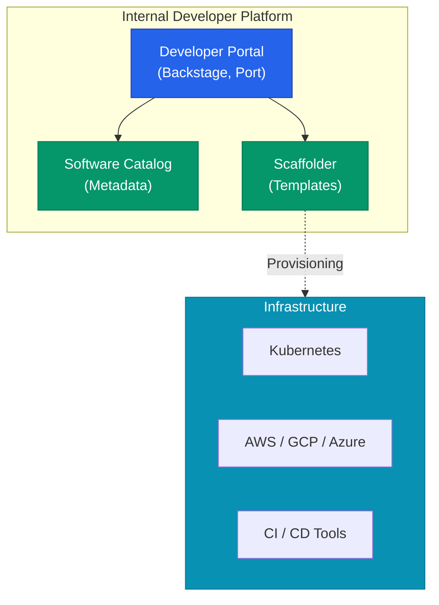

플랫폼 엔지니어링의 정수는 **내부 개발자 플랫폼**(Internal Developer Platform, IDP)을 통해 구체화됩니다. IDP는 개발자가 애플리케이션의 전체 생애주기를 스스로 관리할 수 있게 돕는 도구의 집합입니다. 단순히 여러 도구를 모아둔 것을 넘어, 일관된 사용자 경험과 자동화된 워크플로우를 제공하는 것이 핵심입니다

## IDP의 핵심 컴포넌트

IDP는 개발자가 클라우드 인프라를 직접 조작하지 않아도 되도록 추상화된 계층을 제공합니다



- **Developer Portal**: 개발자가 접속하는 웹 기반 인터페이스(UI)입니다. **Backstage**가 가장 대표적입니다
- **Software Catalog**: 사내의 모든 서비스, API, 라이브러리의 상태와 소유권을 한눈에 파악할 수 있는 인벤토리입니다
- **Scaffolder**: 표준화된 템플릿을 사용하여 새 프로젝트를 즉시 생성하는 도구입니다

## 소프트웨어 카탈로그와 메타데이터

우리 회사의 서비스가 수백 개라면, "이 API는 누가 관리하지?", "이 서비스의 문서 주소는 뭐지?"라는 질문에 답하기 어렵습니다. 카탈로그는 이 문제를 **정적 설정 파일**(`catalog-info.yaml`)을 통해 해결합니다

```yaml
# Backstage 카탈로그 설정 예시
apiVersion: backstage.io/v1alpha1
kind: Component
metadata:
  name: user-service
  description: 사용자 인증 및 프로필 관리 서비스
spec:
  type: service
  owner: auth-team
  lifecycle: production
```

이 파일을 코드 저장소에 두기만 하면, 포털에서 자동으로 소유자, 문서, 모니터링 대시보드 링크를 연결해 줍니다

## 셀프 서비스와 스캐폴딩(Scaffolding)

새로운 마이크로서비스를 시작할 때, 인프라 팀에 티켓을 보내는 대신 포털에서 **템플릿**을 선택합니다

| 단계 | 기존 방식 (Ticket-based) | IDP 방식 (Self-service) |
|---|---|---|
| **요청** | 인프라 팀에 Jira 티켓 생성 | 포털에서 템플릿 선택 |
| **대기** | 담당자 배정까지 수일 대기 | **즉시 실행** |
| **생성** | 수동으로 DB, Repo, CI 생성 | 스캐폴더가 API로 자동 생성 |
| **결과** | 환경마다 설정이 다를 수 있음 | 사내 표준이 적용된 코드 생성 |

개발자는 5분 만에 사내 표준이 적용된 Git 저장소, CI/CD 파이프라인, 개발용 데이터베이스를 얻을 수 있습니다

<div class="callout why">
  <div class="callout-title">성공하는 IDP의 조건: 추상화의 깊이</div>
  너무 얕은 추상화는 개발자가 여전히 인프라를 알아야 하게 만들고, 너무 깊은 추상화는 유연성을 해칩니다. <b>"자유를 주는 동시에 책임의 범위를 명확히 하는 것"</b>이 IDP 설계의 가장 어려운 점이자 핵심입니다
</div>

## 도구 선택: Backstage vs Port

IDP를 구축할 때 가장 많이 고려되는 두 가지 선택지입니다

- **Backstage (Spotify)**: 플러그인 생태계가 매우 강력하지만, 개발자가 직접 React와 TypeScript로 기능을 확장해야 하는 부담이 있습니다
- **Port / Compass**: SaaS 기반의 포털로, 코드 작성 없이 설정만으로 빠르게 카탈로그와 대시보드를 구축할 수 있습니다

## 정리

- **IDP**는 개발자의 생산성을 극대화하기 위한 운영체제와 같습니다
- **소프트웨어 카탈로그**를 통해 시스템의 복잡성을 가시화합니다
- **셀프 서비스** 환경은 인프라 팀의 병목을 제거합니다
- 사내의 기술적 성숙도에 따라 적합한 포털 도구를 선택해야 합니다

다음 글에서는 플랫폼 엔지니어링의 실질적인 혜택인 **골든 패스(Golden Path)**에 대해 알아봐요
