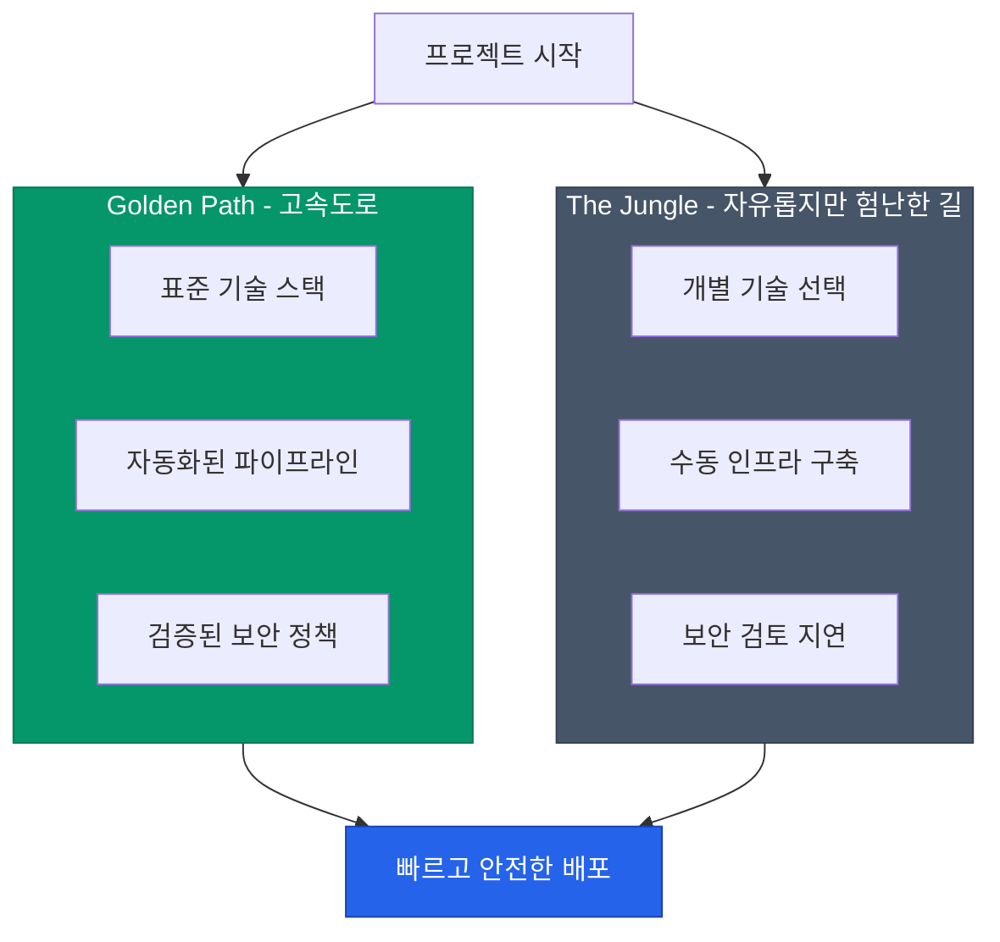

개발자가 새로운 프로젝트를 시작할 때마다 "언어 버전은 뭐로 하지?", "로깅 라이브러리는 어떤 게 좋지?", "배포 파이프라인은 어떻게 짜지?"와 같은 수많은 결정에 직면합니다. **골든 패스**(Golden Path)는 이러한 반복적인 결정들을 사내 표준으로 정의하고 자동화하여, 개발자가 가장 빠르고 안전하게 목표에 도달할 수 있는 길을 열어주는 개념입니다.

## 골든 패스: 닦여진 길(Paved Road)

골든 패스는 넷플릭스에서 유행시킨 **Paved Road**(닦여진 길)와 같은 의미로 사용됩니다. 숲속을 헤매는 대신, 잘 닦인 고속도로를 타고 목적지까지 빠르게 이동하게 만드는 것이 목적입니다.

골든 패스를 따르는 팀은 플랫폼 팀의 전폭적인 지원과 최적화된 도구를 누릴 수 있습니다. 반면, 골든 패스를 벗어난 팀은 자유를 얻는 대신 운영과 보안에 대한 모든 책임을 직접 져야 합니다.

## 골든 패스가 해결하는 문제

| 문제점 | 골든 패스의 해결책 |
|---|---|
| **결정 피로** | 검증된 기술 스택과 라이브러리를 기본값으로 제공 |
| **파편화된 인프라** | 일관된 방식의 배포 및 모니터링 환경 구축 |
| **보안 사각지대** | 보안 스캔과 인증 체계가 파이프라인에 기본 포함 |
| **지식 전파의 어려움** | 사내 표준 가이드가 문서화되어 협업 용이 |

## 성과 측정: DORA 메트릭

플랫폼 엔지니어링과 골든 패스가 실제로 생산성을 높였는지 어떻게 알 수 있을까요? 구글의 DevOps 연구 조직이 정의한 **DORA 메트릭**이 좋은 기준이 됩니다.

1. **Deployment Frequency**: 얼마나 자주 배포하는가?
2. **Lead Time for Changes**: 코드 커밋부터 배포까지 얼마나 걸리는가?
3. **Change Failure Rate**: 배포 시 실패할 확률이 얼마나 낮은가?
4. **Time to Restore Service**: 장애 발생 시 복구에 얼마나 걸리는가?

골든 패스가 잘 구축된 조직일수록 배포 빈도는 높아지고, 리드 타임과 실패율은 낮아집니다.

  
핵심 인사이트: 강제가 아닌 권장

  골든 패스의 성공 여부는 <b>"얼마나 많은 팀이 자발적으로 이 길을 선택하는가"</b>에 달려 있습니다. 플랫폼 팀은 "반드시 이렇게 해야 한다"고 규제하는 경찰이 아니라, "이 길이 훨씬 편하고 빠르다"고 설득하는 제품 매니저가 되어야 합니다.

## 안티 패턴: 골든 케이지(Golden Cage)

골든 패스가 너무 경직되어 개발자가 새로운 기술을 시도할 수 없는 상태를 **골든 케이지**(금빛 감옥)라고 부릅니다. 기술 트렌드는 계속 변하므로, 골든 패스 역시 정기적으로 업데이트되어야 하며 예외 케이스를 수용할 수 있는 유연성을 가져야 합니다.

## 정리

- **골든 패스**는 개발자의 인지 부하를 줄이고 비즈니스 로직에 집중하게 만듭니다.
- 잘 닦인 길(Paved Road)을 제공하여 생산성과 보안을 동시에 잡습니다.
- **DORA 메트릭**을 통해 플랫폼의 가치를 정량적으로 증명합니다.
- 유연성을 잃지 않는 지속적인 개선이 성공의 열쇠입니다.

Platform Engineering 시리즈를 통해 DevOps의 다음 단계로 나아가는 여정을 살펴보았습니다. 자동화된 플랫폼과 잘 설계된 골든 패스는 현대적인 개발 조직의 핵심 경쟁력이 될 것입니다.
