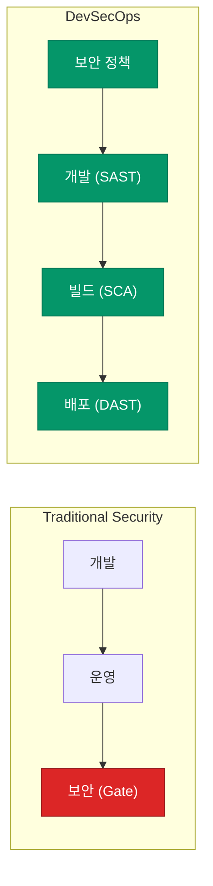

전통적인 개발 환경에서 보안은 보통 릴리즈 직전에 수행하는 '최종 점검' 단계였습니다. 하지만 배포 주기가 빨라지면서 이러한 방식은 큰 병목이 되거나, 시간에 쫓겨 보안 취약점을 놓치는 원인이 되곤 합니다. **DevSecOps**는 보안을 개발과 운영의 모든 단계에 통합하여, 속도와 안전이라는 두 마리 토끼를 잡으려는 철학입니다

## Shift-left: 보안의 전진 배치

DevSecOps의 핵심 키워드는 **Shift-left**입니다. 이는 개발 생애주기(SDLC)의 마지막에 있던 보안 검토를 가능한 앞 단계(왼쪽)로 끌어오는 것을 의미합니다

보안 문제를 일찍 발견할수록 해결 비용은 낮아지고 시스템은 견고해집니다

## 보안의 코드화 (Security as Code)

DevSecOps가 가능하려면 보안 정책이 수동 점검이 아닌 **코드**로 관리되어야 합니다

| 단계 | 보안 활동의 코드화 | 도구 예시 |
|---|---|---|
| **코드 작성** | 정적 분석(SAST) 자동 수행 | Semgrep, SonarQube |
| **의존성 관리** | 오픈소스 라이브러리 취약점 스캔(SCA) | Trivy, Snyk |
| **인프라 구축** | IaC 설정 보안 검증 | tfsec, Checkov |
| **런타임** | 정책 기반의 접근 제어 (Policy as Code) | OPA, Kyverno |

모든 보안 정책이 파이프라인의 일부로 자동 실행될 때, 개발자는 별도의 인지 부하 없이도 안전한 코드를 배포할 수 있습니다

## 속도와 보안의 균형

많은 팀이 보안을 강화하면 개발 속도가 느려질까 걱정합니다. 하지만 진정한 DevSecOps는 **속도를 위한 보안**입니다

1. **마찰 최소화**: 보안 도구는 개발자의 IDE나 PR 리뷰 단계에 녹아들어야 합니다
2. **가시성 제공**: 단순히 "실패"라고 말하는 대신, 무엇이 문제이고 어떻게 고쳐야 하는지 구체적인 피드백을 줍니다
3. **자동 승인**: 사전에 정의된 보안 기준을 통과한 변경 사항은 보안 팀의 수동 검토 없이 즉시 배포될 수 있어야 합니다

  
핵심 인사이트: 보안은 모두의 책임

  DevSecOps의 성공은 도구보다 <b>문화</b>에 달려 있습니다. 보안 팀은 '규제자'에서 '조력자'로 변해야 하며, 개발 팀은 보안을 남의 일이 아닌 '자신의 코드 품질'의 일부로 받아들여야 합니다

## 정리

- DevSecOps는 보안을 전체 파이프라인에 **통합**하는 철학입니다
- **Shift-left**를 통해 취약점을 조기에 발견하고 대응 비용을 줄입니다
- 보안 활동을 **코드화**하여 자동화된 검증 체계를 구축합니다
- 개발 경험(DX)을 해치지 않는 선에서 보안을 자연스럽게 녹여내야 합니다

다음 글에서는 최근 보안의 최대 화두인 **공급망 보안과 이미지 서명**에 대해 알아봐요
