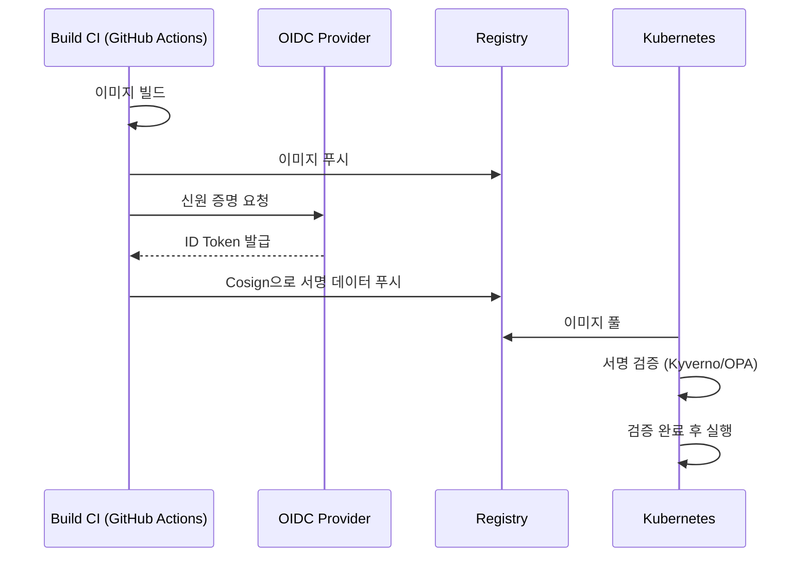

우리가 배포하는 컨테이너 이미지가 정말로 사내 빌드 시스템에서 만들어진 것일까요? 아니면 중간에 누군가 악성 코드를 심어놓지는 않았을까요? **소프트웨어 공급망 보안**(Software Supply Chain Security)은 소스 코드부터 최종 사용자에게 전달되기까지의 전 과정을 보호하고 검증하는 일입니다

## 공급망 보안의 3대 요소

공급망 보안을 강화하기 위해 최근 업계에서 표준으로 자리 잡고 있는 세 가지 핵심 개념입니다

| 요소 | 설명 | 목적 |
|---|---|---|
| **SLSA** | 소프트웨어 제작 단계별 보안 등급 (L1~L4) | 빌드 무결성 보장 |
| **SBOM** | 소프트웨어에 포함된 모든 의존성 명세서 | 취약한 패키지 추적 |
| **Signing** | 결과물에 대한 디지털 서명 | 출처 및 변조 여부 확인 |

## SBOM: 소프트웨어 자재 명세서

**SBOM**(Software Bill of Materials)은 요리 레시피의 성분표와 같습니다. 우리 앱이 어떤 오픈소스 라이브러리를 몇 버전으로 쓰고 있는지 상세히 기록합니다

- **표준 포맷**: CycloneDX, SPDX가 주로 쓰입니다
- **활용**: 새로운 CVE 취약점이 발표되었을 때, 사내의 어떤 이미지들이 영향을 받는지 즉시 찾아낼 수 있습니다

## 이미지 서명: Cosign과 Sigstore

빌드된 이미지가 신뢰할 수 있는 것인지 증명하기 위해 **디지털 서명**을 사용합니다. 최근에는 복잡한 키 관리가 필요 없는 **Sigstore** 생태계의 **Cosign**이 대세입니다

OIDC 연동을 통한 **Keyless 서명**을 사용하면 별도의 개인키를 관리할 필요 없이, 빌드 파이프라인의 신원(예: GitHub Actions 워크플로우 이름)으로 이미지를 신뢰할 수 있습니다

## 클러스터에서의 검증

서명된 이미지를 만드는 것만큼 중요한 것이 **배포 시점의 검증**입니다. 쿠버네티스의 어드미션 컨트롤러(Admission Controller)를 사용하여 서명되지 않은 이미지의 실행을 차단해야 합니다

- **Kyverno**: 정책 기반으로 이미지 서명을 검증하고, 서명이 없으면 Pod 생성을 거부합니다
- **OPA/Gatekeeper**: 더 복잡한 비즈니스 로직을 포함한 검증 정책을 세울 수 있습니다

  
핵심 인사이트: "Trust, but Verify"

  사내 레지스트리에 있는 이미지라고 무조건 믿어서는 안 됩니다. <b>"누가, 언제, 어떤 코드로"</b> 만들었는지 기계적으로 확인할 수 있는 서명 체계가 갖춰져야만 진정한 제로 트러스트(Zero Trust) 보안을 실현할 수 있습니다

## 정리

- 공급망 보안은 소스 코드에서 배포까지의 **무결성**을 다룹니다
- **SBOM**을 통해 사내 소프트웨어의 투명성을 확보합니다
- **Cosign**을 활용하여 빌드 결과물에 대한 출처 증명을 자동화합니다
- 쿠버네티스 레벨에서 **정책 기반 검증**을 통해 보안을 강제합니다

다음 글에서는 파이프라인 곳곳에서 취약점을 찾아내는 **SAST·DAST·의존성 스캔** 도구들에 대해 알아봐요
