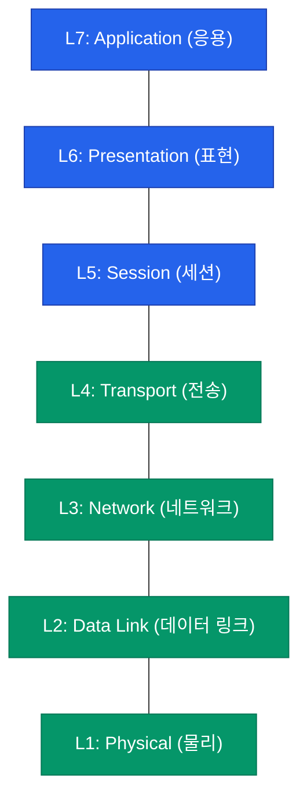

네트워크는 수많은 하드웨어와 소프트웨어가 복잡하게 얽혀 동작하는 거대한 시스템입니다. 이 복잡성을 관리하고 서로 다른 제조사의 장비들이 원활하게 소통할 수 있도록 만든 약속이 바로 **OSI 7계층 모델**(Open Systems Interconnection Reference Model)입니다

## 계층화의 목적: 분할과 정복

OSI 모델은 통신 과정을 7개의 논리적인 단계로 나눕니다. 이렇게 계층을 나눈 데에는 명확한 이유가 있습니다

- **표준화**: 서로 다른 제조사 장비 간의 호환성을 보장합니다
- **모듈화**: 특정 계층의 변경이 다른 계층에 영향을 주지 않아 유지보수가 쉽습니다
- **학습과 트러블슈팅**: 문제가 발생했을 때 어느 단계에서 오류가 났는지 빠르게 파악할 수 있습니다

## OSI 7계층 구조

데이터가 송신 측에서 수신 측으로 전달되는 흐름을 계층별로 시각화하면 다음과 같습니다

보통 L1~L4를 **하위 계층**(데이터 전달 중심), L5~L7을 **상위 계층**(사용자 서비스 중심)으로 분류합니다

## 각 계층의 역할과 데이터 단위

| 계층 | 역할 | 프로토콜 / 장비 | 데이터 단위 |
|---|---|---|---|
| **L7 Application** | 사용자가 네트워크에 접속하는 접점 | HTTP, FTP, SMTP | Data |
| **L6 Presentation** | 데이터의 형식 변환, 암호화, 압축 | JPEG, MPEG, SSL/TLS | Data |
| **L5 Session** | 통신 세션 유지 및 동기화 | RPC, NetBIOS | Data |
| **L4 Transport** | 종단 간 신뢰성 있는 데이터 전송 | TCP, UDP / L4 스위치 | Segment |
| **L3 Network** | 최적의 경로 설정 (라우팅) | IP, ICMP / 라우터 | Packet |
| **L2 Data Link** | 물리적 인접 장치 간 전송, 오류 제어 | Ethernet, Wi-Fi / 스위치 | Frame |
| **L1 Physical** | 비트 단위의 전기적/광학적 신호 전송 | 케이블, 허브, 리피터 | Bit |

## 데이터의 흐름: 캡슐화와 역캡슐화

데이터가 전송될 때는 상위 계층에서 하위 계층으로 내려가며 각 계층의 제어 정보(Header)가 붙는 **캡슐화**(Encapsulation) 과정을 거칩니다. 반대로 수신 측에서는 하위에서 상위로 올라가며 헤더를 제거하는 **역캡슐화**(Decapsulation)를 수행합니다

  
핵심 차이: OSI vs TCP/IP

  OSI 모델이 이론적이고 교육적인 참조 모델이라면, 우리가 실제 인터넷에서 사용하는 규격은 <b>TCP/IP 4계층 모델</b>입니다. 하지만 실무에서도 "L3 스위치", "L7 로드밸런서"처럼 OSI 계층을 기준으로 장비와 기술을 지칭하는 경우가 많으므로 정확한 이해가 필수적입니다

## 정리

- OSI 모델은 네트워크 통신을 7단계로 표준화한 참조 모델입니다
- 각 계층은 독립적인 기능을 수행하며 상하 계층과 상호작용합니다
- 하위 계층은 데이터 전달에, 상위 계층은 사용자 서비스에 집중합니다

다음 글에서는 실제 인터넷의 근간이 되는 **TCP/IP 스택 구조**를 OSI 모델과 비교하며 상세히 분석합니다
