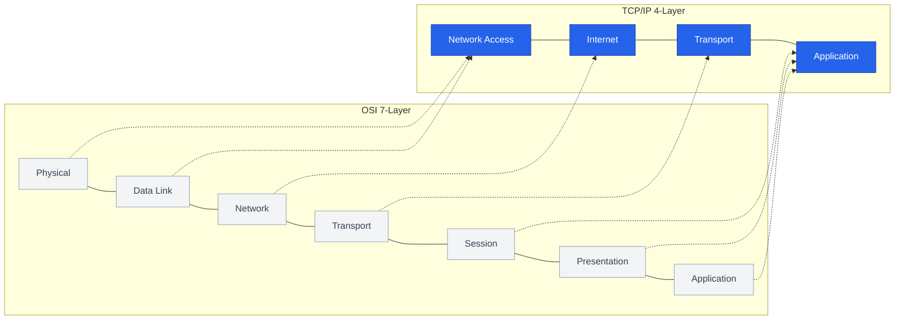

이전 글에서 다룬 OSI 모델이 이론적인 가이드라인이라면, **TCP/IP 4계층 모델**(Internet Protocol Suite)은 실제로 우리가 사용하는 인터넷이 동작하는 방식입니다. 단순하고 효율적인 구조 덕분에 오늘날 전 세계 네트워크의 실질적인 표준으로 자리 잡았습니다

## OSI 7계층 vs TCP/IP 4계층

TCP/IP 모델은 OSI 7계층 중 역할이 겹치거나 실질적으로 통합된 계층들을 하나로 묶어 4개의 계층으로 간소화했습니다

## 계층별 역할과 핵심 프로토콜

| 계층 | OSI 매핑 | 주된 역할 | 프로토콜 |
|---|---|---|---|
| **4. Application** | L5~L7 | 사용자와 애플리케이션 간의 데이터 교환 | HTTP, DNS, SMTP, SSH |
| **3. Transport** | L4 | 프로세스 간의 통신, 데이터 전송 제어 | TCP, UDP |
| **2. Internet** | L3 | 네트워크 간 데이터 패킷 라우팅 | IP, ICMP, ARP |
| **1. Network Access** | L1~L2 | 물리적 네트워크를 통한 데이터 프레임 전송 | Ethernet, Wi-Fi, PPP |

## TCP/IP 모델의 핵심: Internet 계층 (IP)

인터넷 계층은 패킷이 목적지까지 도달하도록 경로를 설정하는 역할을 합니다. **비연결형(Connectionless)** 서비스인 IP 프로토콜을 사용하며, 패킷의 도착 순서나 유실을 보장하지 않습니다. 이러한 "최선의 노력(Best-effort)" 전달 방식은 인프라의 복잡성을 낮추고 확장성을 높이는 핵심 요인이 되었습니다

## 신뢰성의 확보: Transport 계층 (TCP)

하위 계층(Internet)에서 보장하지 않는 데이터의 신뢰성을 Transport 계층에서 해결합니다. TCP는 **연결 지향형** 통신을 통해 데이터의 순서를 맞추고, 유실된 데이터를 재전송하며, 흐름 제어(Flow Control)를 수행합니다

  
왜 TCP/IP가 승리했는가

  OSI 모델이 완벽한 이론적 설계를 지향하는 동안, TCP/IP는 초기 인터넷인 ARPANET 시절부터 <b>실제 구현과 검증</b>을 통해 발전했습니다. "동작하는 코드가 우선이다"라는 철학이 반영된 모델이며, 복잡한 세션/표현 계층을 애플리케이션 영역으로 넘겨버림으로써 압도적인 효율성을 확보했습니다

## 정리

- TCP/IP 모델은 인터넷 통신의 실질적인 표준 아키텍처입니다
- OSI 7계층을 4개의 계층으로 간소화하여 효율성을 높였습니다
- 상위 계층의 신뢰성(TCP)과 하위 계층의 경로 설정(IP)이 맞물려 동작합니다

다음 글에서는 Internet 계층의 핵심인 **IP 주소 체계와 라우팅의 원리**에 대해 깊이 있게 다뤄보겠습니다
