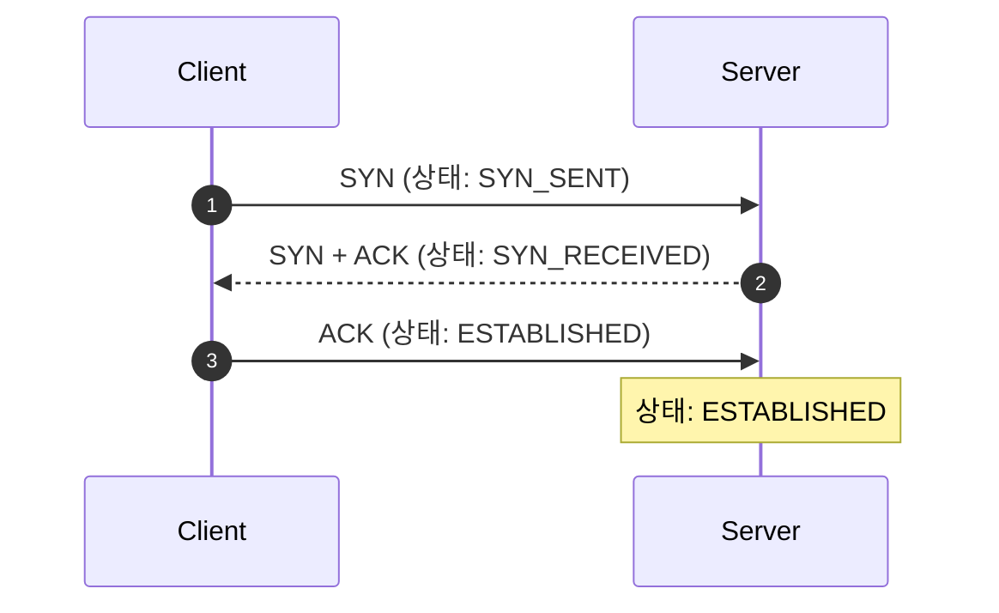

IP가 데이터를 목적지까지 배달하는 '주소'와 '경로'에 집중한다면, **TCP**(Transmission Control Protocol)는 전달된 데이터가 누락되거나 순서가 바뀌지 않았는지 확인하는 '신뢰성'에 집중합니다. 전송 계층(L4)에서 동작하는 TCP의 핵심 매커니즘을 정리합니다

## 연결의 시작과 끝: 3-way & 4-way 핸드셰이크

TCP는 데이터를 주고받기 전에 양단 간의 논리적인 연결을 먼저 확립하는 **연결 지향**(Connection-oriented) 프로토콜입니다

### 연결 성립 (3-way Handshake)

두 장치가 서로 통신할 준비가 되었는지 확인하는 과정입니다

1. **SYN**: 클라이언트가 서버에게 연결 요청을 보냅니다
2. **SYN + ACK**: 서버가 요청을 수락하고, 자신도 연결할 준비가 되었음을 알립니다
3. **ACK**: 클라이언트가 서버의 수락을 확인하며 최종적으로 연결을 맺습니다

### 연결 해제 (4-way Handshake)

통신이 끝난 후 안전하게 연결을 종료하는 과정입니다

1. **FIN**: 클라이언트가 통신을 마쳤음을 알립니다
2. **ACK**: 서버가 일단 알겠다는 확인을 보냅니다 (남은 데이터 송신 중)
3. **FIN**: 서버도 모든 데이터를 보냈고 종료할 준비가 되었음을 알립니다
4. **ACK**: 클라이언트가 최종 확인을 보내고 일정 시간(TIME_WAIT) 후 종료합니다

## 흐름 제어 (Flow Control)

송신 측이 너무 빨리 데이터를 보내 수신 측의 버퍼가 넘치는 현상을 방지하는 기술입니다. **슬라이딩 윈도우**(Sliding Window) 방식을 사용합니다

- **수신 윈도우(RWND)**: 수신 측이 현재 처리할 수 있는 데이터의 잔여 공간입니다
- 송신 측은 수신 측이 보낸 ACK 패킷의 윈도우 크기를 보고 보낼 양을 조절합니다

## 혼잡 제어 (Congestion Control)

네트워크망 자체가 혼잡하여 패킷 전송이 지연되거나 손실되는 것을 방지하는 기술입니다. 송신 측 스스로 네트워크 상황을 판단하여 데이터 양을 조절합니다

| 단계 | 동작 원리 |
|---|---|
| **Slow Start** | 전송량을 지수적으로 늘려가며 네트워크 수용량을 탐색합니다 |
| **Congestion Avoidance** | 임계치에 도달하면 전송량을 선형적으로 천천히 늘립니다 |
| **Fast Retransmit** | 손실이 감지되면 즉시 재전송하여 지연을 최소화합니다 |
| **Fast Recovery** | 손실 후 전송량을 반으로 줄이고 다시 회복을 시도합니다 |

## 오류 제어와 재전송

TCP는 데이터가 유실되었을 때 이를 감지하고 다시 보내는 기능을 갖추고 있습니다

- **Sequence Number**: 패킷에 번호를 매겨 순서를 보장합니다
- **Checksum**: 데이터 변조 여부를 확인합니다
- **Timeout & Retransmission**: 일정 시간 내에 ACK를 받지 못하면 재전송합니다

  
핵심 차이: 전송 단위 (Segment)

  TCP에서 다루는 데이터 단위를 <b>세그먼트</b>(Segment)라고 부릅니다. 각 세그먼트에는 포트 번호, 순서 번호, 확인 응답 번호 등이 포함된 헤더가 붙어 IP 패킷의 페이로드로 실려 나가게 됩니다

## 정리

- TCP는 핸드셰이크를 통해 신뢰성 있는 연결을 확립합니다
- 슬라이딩 윈도우를 통해 수신 측의 처리 속도에 맞춰 흐름을 제어합니다
- 혼잡 제어 알고리즘을 통해 네트워크 전체의 병목 현상을 방지합니다

다음 글에서는 TCP와 대조되는 특성을 가진 **UDP와 비연결형 통신**에 대해 살펴봅니다
