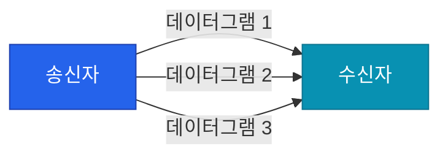

신뢰성을 최우선으로 하는 TCP와 달리, **UDP**(User Datagram Protocol)는 신뢰성보다는 '속도'와 '효율성'에 집중합니다. 복잡한 핸드셰이크나 흐름 제어 과정을 생략하고 데이터를 바로 던지는 UDP의 매력을 파헤쳐 봅니다

## UDP의 핵심 특징: 단순함과 빠름

UDP는 전송 계층(L4)에서 동작하는 **비연결형**(Connectionless) 프로토콜입니다. 데이터를 보내기 전에 연결을 맺는 과정이 없으며, 일단 보낸 데이터가 잘 도착했는지 확인하지도 않습니다

- **비연결형 서비스**: 1:1, 1:N, N:N 통신이 모두 가능합니다
- **최소한의 오버헤드**: 헤더 크기가 매우 작고 기능이 단순합니다
- **순서 보장 없음**: 데이터가 보낸 순서대로 도착하지 않을 수 있습니다
- **신뢰성 낮음**: 데이터가 유실되어도 재전송하지 않습니다

## TCP vs UDP 비교

두 프로토콜의 차이를 한눈에 비교하면 다음과 같습니다

| 구분 | TCP | UDP |
|---|---|---|
| **연결 방식** | 연결 지향 (3-way handshake) | 비연결형 |
| **전송 순서** | 보장함 (Sequence Number) | 보장하지 않음 |
| **신뢰성** | 높음 (확인 응답 및 재전송) | 낮음 |
| **속도** | 상대적으로 느림 | 매우 빠름 |
| **전송 단위** | 세그먼트 (Segment) | 데이터그램 (Datagram) |
| **헤더 크기** | 20 ~ 60 바이트 | 8 바이트 |

## UDP 헤더 구조: 8바이트의 마법

UDP 헤더는 매우 간단합니다. 필요한 정보만 딱 담고 있어 처리가 매우 빠릅니다

1. **Source Port**: 보내는 측의 포트 번호
2. **Destination Port**: 받는 측의 포트 번호
3. **Length**: 헤더를 포함한 전체 데이터그램의 길이
4. **Checksum**: 데이터의 최소한의 오류 검출용 (옵션)

## 데이터 전송 흐름

UDP의 전송 과정은 별도의 '확인' 절차가 없어 매우 직관적입니다

수신자가 준비되었는지 묻지 않고 바로 보냅니다. 중간에 패킷이 사라지더라도 송신자는 이를 알지 못하고 계속 다음 데이터를 보냅니다

## UDP는 언제 사용할까?

데이터의 완결성보다 실시간성이 훨씬 중요한 서비스에서 빛을 발합니다

- **실시간 스트리밍**: 영상이나 음성 데이터는 한두 프레임 빠지는 것보다 끊김 없이 재생되는 것이 중요합니다
- **DNS (Domain Name System)**: 짧은 요청과 응답으로 이루어져 있어 핸드셰이크의 오버헤드가 없는 UDP가 유리합니다
- **온라인 게임**: 캐릭터의 위치 정보 등은 최신 정보가 중요하므로 유실된 과거 정보를 재전송받을 필요가 없습니다
- **SNMP**: 네트워크 장비 상태 감시 등 주기적인 알림에 사용됩니다

  
핵심 차이: 전송 단위 (Datagram)

  UDP에서 다루는 데이터 단위를 <b>데이터그램</b>(Datagram)이라고 부릅니다. 독립적인 관계를 가진 패킷이라는 의미가 담겨 있으며, 각 데이터그램은 서로의 존재를 모른 채 개별적으로 네트워크를 통과합니다

## 정리

- UDP는 연결 과정이 없는 단순하고 빠른 프로토콜입니다
- 신뢰성은 낮지만 오버헤드가 적어 실시간 서비스에 적합합니다
- TCP는 '정확성'이 필요한 곳에, UDP는 '속도'가 필요한 곳에 사용됩니다

다음 글에서는 인터넷의 전화번호부 역할을 하는 **DNS 동작 원리**에 대해 상세히 분석합니다
