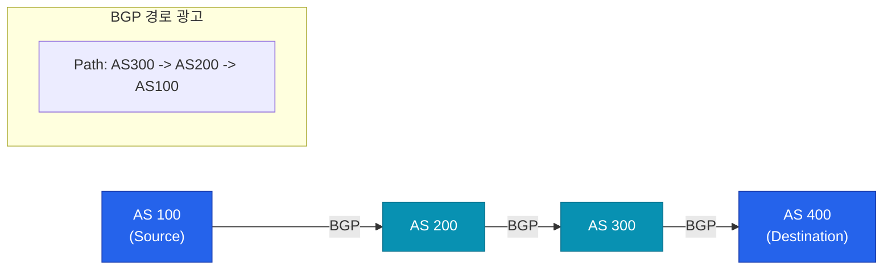

인터넷은 수많은 독립적인 네트워크들의 집합체입니다. 우리 집의 패킷이 지구 반대편의 서버까지 길을 잃지 않고 찾아갈 수 있는 이유는 무엇일까요? 그 해답은 인터넷의 기본 지도이자 길잡이 역할을 하는 **BGP**(Border Gateway Protocol)에 있습니다

## 자율 시스템 (Autonomous System, AS)

인터넷은 거대한 하나의 네트워크가 아니라, 수천 개의 **AS**가 서로 연결된 형태입니다. AS는 하나의 관리 주체(ISP, 대기업, 대학 등)가 운영하는 네트워크 단위를 의미합니다

- **AS 번호(ASN)**: 각 AS는 고유한 번호를 부여받아 식별됩니다
- **IGP vs EGP**: AS 내부에서 경로를 찾는 프로토콜(OSPF 등)을 IGP, AS 간에 경로를 찾는 프로토콜을 EGP라고 부르며 BGP는 유일한 EGP 표준입니다

## BGP의 핵심 원리: 경로 벡터 라우팅

BGP는 단순히 '가장 짧은 거리'를 찾지 않습니다. 대신 **경로 벡터**(Path Vector) 방식을 사용하여 데이터가 거쳐갈 AS 목록을 관리합니다

- **경로 광고(Advertisement)**: 각 AS는 자신이 알고 있는 IP 대역 정보를 이웃 AS에게 알립니다
- **루프 방지**: 경로 목록에 자신의 ASN이 포함되어 있으면 해당 경로를 무시하여 무한 루프를 방지합니다

## BGP의 결정 요소: 정책 기반 라우팅

BGP는 기술적인 최적화보다 **비즈니스 정책**을 우선시합니다. 가장 빠른 길이라도 비용이 비싸거나 정치적인 이유로 피해야 한다면 다른 길을 선택할 수 있습니다

1. **Weight**: 특정 라우터 내부에서 결정하는 우선순위
2. **Local Preference**: AS 내부에서 외부로 나가는 경로 중 선호하는 길
3. **AS Path length**: 거쳐가는 AS의 개수가 적은 쪽 선택
4. **MED (Multi-Exit Discriminator)**: 외부 AS에게 우리 네트워크로 들어올 때 선호하는 통로를 제안

## 왜 BGP가 중요할까?

BGP는 인터넷의 안정성을 지탱하는 근간입니다. BGP 설정 오류(BGP Hijacking)가 발생하면 전 세계의 트래픽이 엉뚱한 곳으로 흘러가 대규모 인터넷 마비 사태가 벌어지기도 합니다

- **글로벌 도달성**: 전 세계 어떤 IP와도 통신할 수 있게 합니다
- **동적 경로 복구**: 특정 링크가 끊어져도 BGP가 실시간으로 우회 경로를 찾아냅니다

  
BGP는 '신뢰' 기반 프로토콜입니다

  BGP는 기본적으로 상대방이 광고하는 정보를 믿고 받아들입니다. 이 취약점을 보완하기 위해 최근에는 디지털 서명을 사용하는 <b>RPKI</b>와 같은 보안 강화 기술이 필수적으로 적용되고 있습니다

## 정리

- BGP는 AS 간에 경로 정보를 교환하는 인터넷의 표준 라우팅 프로토콜입니다
- 단순 거리보다는 비즈니스 정책과 경로 벡터를 기반으로 동작합니다
- 인터넷의 전 지구적 연결과 안정성을 책임지는 핵심 인프라입니다

다음 글에서는 하나의 IP로 전 세계에서 가장 가까운 서버를 찾아가는 **Anycast와 글로벌 트래픽** 기법을 다뤄봅니다
