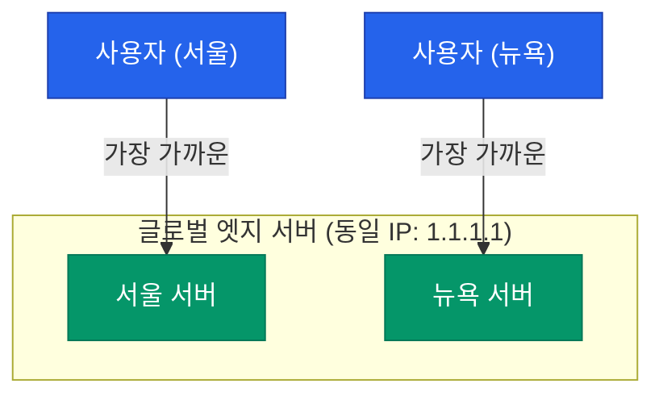

구글(8.8.8.8)이나 클라우드플레어(1.1.1.1)의 DNS는 전 세계 어디서 접속해도 놀랍도록 빠릅니다. 전 세계에 수천 대의 서버가 있는데, 우리는 어떻게 항상 '가장 가까운 서버'를 찾아가는 것일까요? 그 비밀은 **Anycast**라는 마법 같은 전송 방식에 있습니다

## 유니캐스트 vs 애니캐스트

우리가 아는 대부분의 통신은 1:1 방식인 유니캐스트입니다. 하지만 애니캐스트는 조금 다른 접근 방식을 취합니다

- **Unicast**: 특정 IP 주소는 오직 하나의 호스트(서버)를 가리킵니다. 물리적으로 멀면 지연 시간이 길어집니다
- **Anycast**: 전 세계 여러 곳의 서버가 **동일한 IP 주소**를 가집니다. 네트워크상에서 '가장 가까운' 서버가 응답합니다

## 애니캐스트는 어떻게 동작할까?

애니캐스트는 별도의 프로토콜이 아니라 **BGP의 동작 원리**를 활용한 기법입니다

1. 전 세계 각지의 데이터 센터에 있는 라우터들이 동일한 IP 대역을 BGP를 통해 광고합니다
2. 인터넷상의 다른 라우터들은 자신에게 가장 짧은 AS Path를 가진 경로를 선택합니다
3. 결과적으로 사용자의 패킷은 네트워크 거리(Hop count)가 가장 짧은 노드로 자연스럽게 흘러가게 됩니다

## 애니캐스트의 장점

글로벌 서비스를 운영할 때 애니캐스트는 엄청난 이점을 제공합니다

- **지연 시간(Latency) 최소화**: 사용자와 지리적으로, 네트워크적으로 가장 가까운 서버가 응답하므로 속도가 빠릅니다
- **부하 분산(Load Balancing)**: 트래픽이 전 세계 거점으로 자연스럽게 분산됩니다
- **DDoS 방어**: 특정 지역에서 대규모 공격이 발생해도 해당 지역의 노드만 영향을 받고, 다른 지역의 트래픽은 정상적인 노드로 우회됩니다
- **고가용성**: 특정 서버가 다운되면 BGP 경로 광고가 중단되고, 트래픽은 자동으로 다음으로 가까운 서버로 전달됩니다

## 애니캐스트의 한계와 주의점

모든 서비스에 애니캐스트가 정답은 아닙니다

- **상태 유지의 어려움**: TCP 연결 도중 네트워크 경로가 바뀌면 다른 서버로 패킷이 튈 수 있습니다(Flapping). 이 때문에 주로 상태가 없는(Stateless) **UDP 기반의 DNS**나 **HTTP 프록시** 서비스에 주로 사용됩니다
- **정교한 제어 부족**: BGP는 네트워크 거리를 기준으로 하므로, 서버의 현재 CPU 부하 등을 고려하여 트래픽을 정교하게 나누기는 어렵습니다

  
핵심 차이: 지리적 거리 vs 네트워크 거리

  애니캐스트가 찾는 '가장 가까운 곳'은 직선거리가 아니라 <b>BGP 경로가 가장 짧은 곳</b>입니다. 가끔 물리적으로는 멀어도 네트워크 회선이 더 좋은 경로로 연결될 수도 있습니다

## 정리

- 애니캐스트는 동일한 IP를 전 세계 여러 거점에서 공유하는 전송 방식입니다
- BGP 라우팅을 통해 사용자에게 가장 가까운 서버로 트래픽을 유도합니다
- DNS, CDN, 글로벌 로드 밸런서의 핵심 기술로 사용됩니다

다음 글에서는 단일 서버의 한계를 넘어 트래픽을 효율적으로 관리하는 **로드 밸런싱 아키텍처**를 분석합니다
