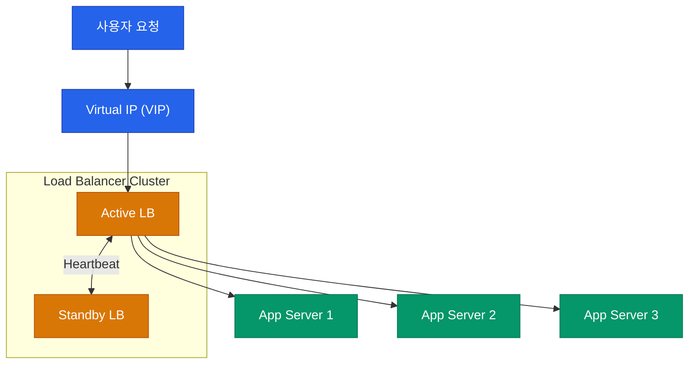

단 한 대의 서버로 수만 명의 동시 접속자를 감당하는 것은 불가능합니다. 서비스가 커지면 여러 대의 서버를 병렬로 배치하고 트래픽을 공평하게 나누어 주어야 합니다. 이 역할을 담당하는 네트워크의 지휘자가 바로 **로드 밸런서**(Load Balancer)입니다

## L4 로드 밸런서 vs L7 로드 밸런서

로드 밸런서는 OSI 계층 중 어느 정보를 기준으로 트래픽을 나누느냐에 따라 크게 두 종류로 나뉩니다

| 구분 | L4 로드 밸런서 (전송 계층) | L7 로드 밸런서 (응용 계층) |
|---|---|---|
| **판단 근거** | IP, 포트 번호, 프로토콜 | URL, HTTP 헤더, 쿠키, 페이로드 |
| **속도** | 패킷 수준에서 처리하므로 매우 빠름 | 데이터를 파싱해야 하므로 상대적으로 느림 |
| **유연성** | 낮음 (단순 분산) | 높음 (콘텐츠 기반 정교한 라우팅) |
| **용도** | 대규모 트래픽 1차 분산 | MSA 아키텍처, 지능형 라우팅 |

## 주요 로드 밸런싱 알고리즘

트래픽을 어떤 기준으로 나눌 것인지는 서비스의 특성에 따라 결정해야 합니다

- **라운드 로빈 (Round Robin)**: 순서대로 돌아가며 배분합니다. 서버 성능이 동일할 때 적합합니다
- **가중 라운드 로빈 (Weighted Round Robin)**: 서버 성능에 따라 가중치를 부여합니다. 고성능 서버에 더 많은 트래픽을 보냅니다
- **최소 연결 (Least Connection)**: 현재 연결 수가 가장 적은 서버를 선택합니다. 처리 시간이 긴 요청이 많을 때 유리합니다
- **IP 해시 (IP Hash)**: 클라이언트의 IP를 해싱하여 특정 서버에 고정합니다. 세션 유지가 필요한 경우 사용합니다

## 고가용성(HA)을 위한 아키텍처

로드 밸런서 자체가 고장 나면 전체 서비스가 마비됩니다(SPOF). 이를 방지하기 위해 로드 밸런서 또한 이중화가 필수입니다

- **VIP (Virtual IP)**: 사용자는 실제 서버 IP가 아닌 가상의 IP를 바라봅니다
- **Heartbeat**: Active 노드가 살아있는지 Standby 노드가 주기적으로 체크합니다. 장애 발생 시 수 초 내에 Standby가 업무를 인계받습니다

## 헬스 체크 (Health Check)

로드 밸런서는 뒤에 있는 서버가 건강한지 끊임없이 감시합니다. 만약 특정 서버가 응답하지 않으면, 즉시 트래픽 대상에서 제외(Exclude)하여 사용자에게 에러가 전달되는 것을 막습니다

- **L3 체크**: ICMP(Ping)로 서버 응답 확인
- **L4 체크**: TCP 포트가 열려있는지 확인
- **L7 체크**: 특정 URL(예: `/healthz`)로 요청을 보내 200 OK 응답이 오는지 확인

  
현대적 트렌드: 서비스 메시

  최근 쿠버네티스 환경에서는 중앙 집중형 로드 밸런서 대신, 각 서비스 옆에 붙은 사이드카 프록시(Istio 등)가 로드 밸런싱을 수행하는 **서비스 메시**(Service Mesh) 구조가 각광받고 있습니다

## 정리

- 로드 밸런서는 트래픽을 분산하여 서비스의 안정성과 확장성을 보장합니다
- 목적에 따라 단순한 L4 방식과 지능적인 L7 방식을 선택하여 사용합니다
- 고가용성을 위해 LB 자체의 이중화와 지속적인 헬스 체크가 동반되어야 합니다

다음 글에서는 전 세계 사용자에게 정적 콘텐츠를 빠르게 전달하는 **CDN 동작과 캐싱 전략**을 알아봅니다
