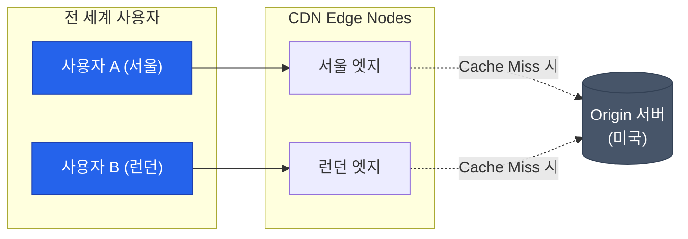

미국에 있는 서버에서 고화질 영상을 보려고 할 때, 데이터가 태평양을 건너오는 시간(Latency)은 물리적으로 피할 수 없는 제약입니다. 하지만 우리는 넷플릭스나 유튜브를 끊김 없이 시청합니다. 이는 전 세계 곳곳에 복사본을 미리 가져다 놓는 **CDN**(Content Delivery Network) 덕분입니다

## CDN의 기본 구조: Origin과 Edge

CDN은 물리적 거리를 줄이기 위해 수천 개의 **엣지 서버**(Edge Server)를 활용합니다

- **Origin Server**: 실제 원본 데이터가 저장된 서버입니다
- **Edge Server (Cache Server)**: 사용자 근처의 거점(PoP, Point of Presence)에 위치하며 원본의 복사본을 캐싱합니다

## CDN은 어떻게 사용자를 가장 가까운 곳으로 보낼까?

사용자가 `cdn.example.com`을 요청할 때, DNS 서버는 사용자의 IP 주소를 분석하여 **가장 가까운 엣지 서버의 IP**를 반환합니다. 이를 위해 앞서 다룬 **애니캐스트(Anycast)** 기법이 주로 사용됩니다

## 주요 캐싱 전략과 용어

CDN을 효율적으로 운영하기 위해서는 '언제 데이터를 가져오고 버릴 것인가'가 중요합니다

- **Cache Hit**: 요청한 데이터가 엣지에 있어 즉시 응답하는 경우
- **Cache Miss**: 데이터가 없어 원본 서버에서 가져와야 하는 경우
- **TTL (Time To Live)**: 캐시된 데이터의 유효 기간입니다. 너무 짧으면 서버 부하가 늘고, 너무 길면 최신 데이터 반영이 늦어집니다
- **Purge / Invalidation**: 원본 데이터가 바뀌었을 때, 강제로 캐시를 삭제하여 최신화하는 작업입니다

## CDN은 무엇을 캐싱할까?

과거에는 정적 파일만 처리했지만, 이제는 그 영역이 넓어지고 있습니다

1. **정적 콘텐츠**: 이미지, CSS, JS, 비디오 파일 등 (전통적 역할)
2. **동적 콘텐츠 가속**: API 응답 등 캐싱이 어려운 데이터도 CDN망의 최적화된 경로를 통해 더 빠르게 전달합니다
3. **엣지 컴퓨팅**: 엣지 서버에서 간단한 로직(인증, 이미지 리사이징 등)을 직접 처리하여 서버 부하를 줄입니다 (Cloudflare Workers, AWS Lambda@Edge 등)

## CDN 사용 시 주의사항

- **보안**: 캐시된 데이터에 민감한 정보가 포함되지 않도록 설정해야 합니다
- **비용**: 트래픽 양에 따라 비용이 발생하므로 효율적인 캐시 적중률(Hit Rate) 관리가 필요합니다
- **버전 관리**: 파일명에 해시값을 포함하는 방식 등을 통해 캐시 갱신 문제를 예방합니다

  
핵심 이점: Origin Shield

  CDN은 단순히 속도만 높이는 것이 아닙니다. 수많은 사용자의 요청을 엣지가 대신 받아주므로, 원본 서버는 직접적인 트래픽 폭주로부터 보호받을 수 있습니다

## 정리

- CDN은 지리적 거리를 극복하기 위해 분산된 엣지 서버를 활용하는 기술입니다
- 캐싱을 통해 원본 서버의 부하를 줄이고 사용자 경험을 개선합니다
- 현대의 CDN은 단순 전송을 넘어 보안과 컴퓨팅 영역까지 확장되고 있습니다

다음 글에서는 TCP의 한계를 넘어서는 혁신적인 프로토콜, **QUIC와 HTTP/3**를 다뤄봅니다
