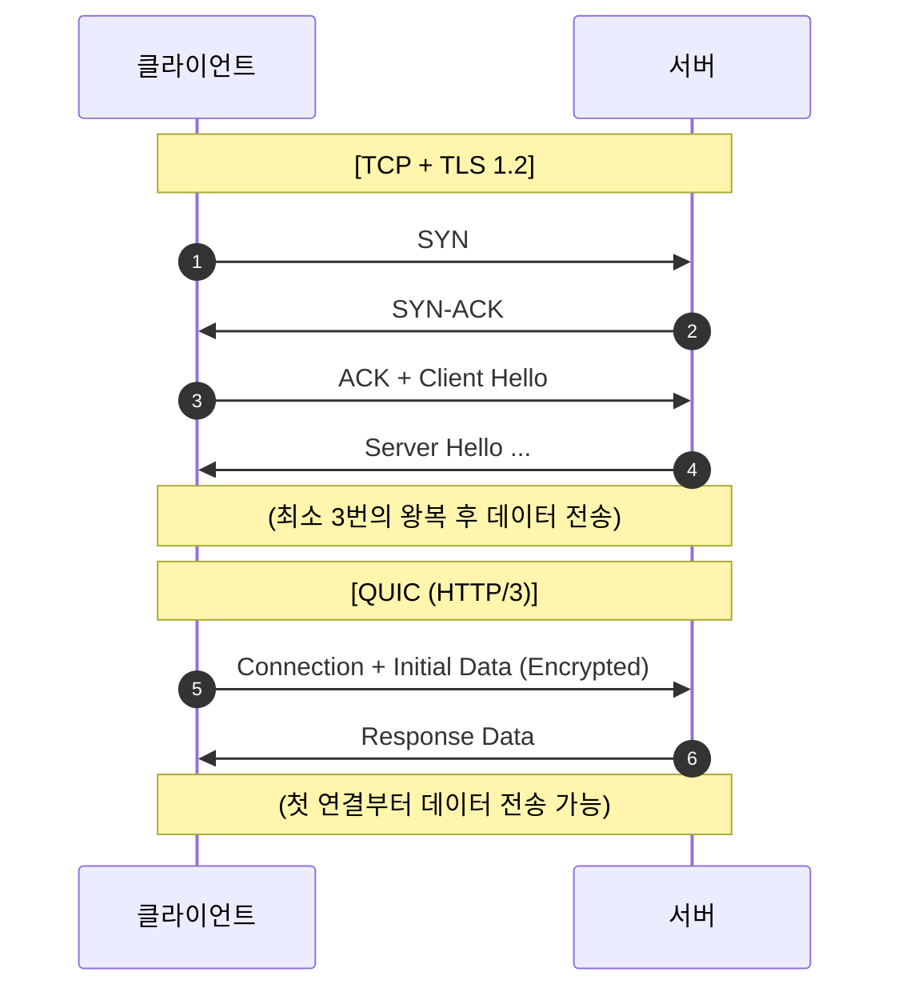

오랜 시간 인터넷을 지탱해 온 TCP는 신뢰성이 높지만, 현대의 웹 환경에서는 '지연 시간'이라는 치명적인 단점을 가지고 있습니다. 이를 극복하기 위해 구글이 제안하고 표준화된 새로운 전송 규약이 바로 **QUIC**와 이를 기반으로 한 **HTTP/3**입니다

## 왜 TCP를 버리고 UDP를 선택했을까?

TCP는 연결을 맺는 과정(3-way handshake)과 보안 설정(TLS handshake)이 순차적으로 일어나며 초기 지연 시간이 깁니다. 또한, 하나의 패킷만 유실되어도 전체 전송이 멈추는 **TCP HOL(Head-of-Line) Blocking** 문제가 있습니다

- **UDP의 활용**: UDP는 자체적으로는 기능이 없지만, 그만큼 가볍고 개발자가 그 위에 원하는 기능을 자유롭게 구현할 수 있습니다
- **QUIC의 탄생**: UDP 위에 TCP의 장점(신뢰성)을 얹고, 단점(지연 시간)은 제거한 프로토콜이 바로 QUIC입니다

## HTTP/3 (QUIC)의 핵심 혁신

### 1. 0-RTT / 1-RTT 연결

TCP+TLS는 데이터를 보내기까지 여러 번의 왕복(Round-trip)이 필요하지만, QUIC은 첫 연결부터 암호화 설정을 포함하여 보냅니다. 한 번 연결했던 서버라면 다음 접속 시 **0번의 왕복(0-RTT)**으로 즉시 데이터를 보낼 수 있습니다

### 2. 멀티플렉싱과 HOL Blocking 해소

HTTP/2도 멀티플렉싱을 지원했지만, 하부의 TCP 패킷이 하나만 빠져도 전체 스트림이 멈췄습니다. QUIC은 각 스트림을 독립적으로 처리하므로, **특정 패킷이 유실되어도 다른 스트림의 데이터 전송은 중단되지 않습니다**

### 3. IP가 바뀌어도 끊기지 않는 연결 (Connection ID)

기존 통신은 IP 주소가 바뀌면 연결이 끊깁니다. 하지만 QUIC은 IP가 아닌 고유한 **Connection ID**를 사용하여 연결을 식별합니다. 사용자가 와이파이에서 LTE로 전환해도 진행 중이던 다운로드가 끊김 없이 유지됩니다

## HTTP 버전별 비교 요약

| 구분 | HTTP/1.1 | HTTP/2 | HTTP/3 |
|---|---|---|---|
| **전송 계층** | TCP | TCP | **UDP (QUIC)** |
| **연결 설정** | 느림 (3-way) | 느림 (3-way) | **매우 빠름 (0~1 RTT)** |
| **HOL Blocking** | 있음 (L7) | 있음 (L4-TCP) | **없음** |
| **보안 (TLS)** | 옵션 (TLS 별도) | 옵션 | **기본 내장 (TLS 1.3)** |
| **IP 전환** | 연결 끊김 | 연결 끊김 | **연결 유지** |

## HTTP/3 도입의 의미

HTTP/3는 단순히 속도만 빠른 것이 아니라, 불안정한 모바일 네트워크 환경에서 훨씬 강력한 성능을 발휘합니다. 이미 구글, 페이스북 등 글로벌 서비스의 트래픽 상당수가 HTTP/3를 통해 흐르고 있습니다

  
왜 아직 완벽히 대체되지 않았을까?

  일부 네트워크 장비나 방화벽이 아직 UDP 기반의 대규모 트래픽을 차단하거나 효율적으로 처리하지 못하는 경우가 있습니다. 이를 위해 브라우저는 보통 HTTP/2를 먼저 시도하고 가능하다면 HTTP/3로 업그레이드하는 방식을 취합니다

## 정리

- QUIC는 UDP 기반의 빠르고 신뢰할 수 있는 새로운 전송 프로토콜입니다
- HTTP/3는 QUIC을 기반으로 초기 지연 시간을 줄이고 연결 안정성을 높였습니다
- 모바일 환경과 고성능 웹 서비스의 미래를 책임지는 기술입니다

다음 글에서는 네트워크 자원을 가상화하여 효율적으로 관리하는 **SDN과 네트워크 가상화**를 다뤄봅니다
