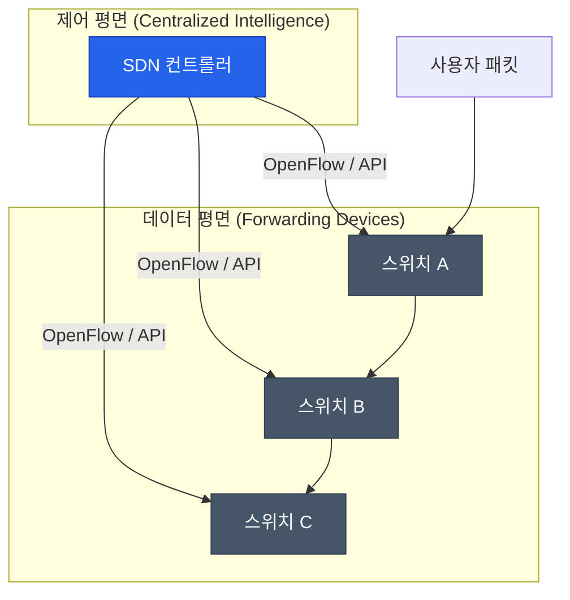

전통적인 네트워크는 각각의 스위치와 라우터가 독자적인 지능을 가지고 동작하는 분산 구조였습니다. 하지만 클라우드 컴퓨팅과 대규모 데이터 센터의 등장으로, 더 유연하고 중앙 집중적인 제어가 필요해졌습니다. 하드웨어의 제약에서 벗어나 소프트웨어로 네트워크를 정의하는 **SDN**(Software Defined Networking)에 대해 알아봅니다

## SDN의 핵심: 평면의 분리

SDN의 가장 큰 특징은 네트워크 장비의 기능을 두 개의 '평면(Plane)'으로 분리한 것입니다

- **제어 평면 (Control Plane)**: 트래픽을 어디로 보낼지 결정하는 '두뇌' 역할입니다. 중앙의 **SDN 컨트롤러**가 이를 담당합니다
- **데이터 평면 (Data Plane)**: 컨트롤러의 지시에 따라 실제 패킷을 전달하는 '몸통' 역할입니다. 물리적 스위치들이 여기에 해당합니다

## 네트워크 가상화 (NFV)

SDN과 함께 자주 언급되는 개념이 **NFV**(Network Functions Virtualization)입니다. 방화벽, 로드 밸런서, VPN 같은 고가의 하드웨어 장비 기능을 가상 머신(VM)이나 컨테이너 상의 소프트웨어로 구현하는 기술입니다

| 구분 | SDN | NFV |
|---|---|---|
| **목표** | 네트워크 제어의 중앙집중화 및 유연성 | 하드웨어 장비의 소프트웨어화 및 비용 절감 |
| **핵심 위치** | 네트워크 스위치 및 컨트롤러 | 서버 상의 가상화된 네트워크 기능 |
| **상호 관계** | 상호 보완적 (보통 함께 사용됨) | SDN 위에서 NFV가 구동되기도 함 |

## SDN이 주는 가치

1. **중앙 집중형 관리**: 수백 대의 장비를 하나하나 설정할 필요 없이, 컨트롤러에서 일괄적으로 정책을 변경할 수 있습니다
2. **프로그래밍 가능한 네트워크**: API를 통해 네트워크 구성을 자동화할 수 있어 인프라 관리가 쉬워집니다
3. **유연한 트래픽 제어**: 부하 상태나 보안 정책에 따라 실시간으로 경로를 최적화할 수 있습니다
4. **멀티 테넌시 지원**: 물리적인 선을 바꾸지 않고도 논리적으로 독립된 여러 네트워크(VPC 등)를 쉽게 생성합니다

## OpenFlow 프로토콜

SDN 컨트롤러와 스위치 사이의 대화를 위한 표준 규약 중 하나가 **OpenFlow**입니다. 컨트롤러는 이 프로토콜을 통해 스위치의 'Flow Table'을 조작하여 특정 조건의 패킷을 어떻게 처리할지 지시합니다

  
클라우드의 기반 기술

  AWS의 VPC(Virtual Private Cloud)나 GCP의 가상 네트워크가 사용자마다 독립적으로 제공될 수 있는 핵심 기술이 바로 SDN입니다. 물리 장비는 하나지만 소프트웨어로 수만 개의 가상 네트워크를 쪼개어 관리하기 때문입니다

## 정리

- SDN은 제어부와 전송부를 분리하여 네트워크를 소프트웨어로 제어하는 기술입니다
- 중앙 집중형 관리를 통해 복잡한 네트워크 인프라의 운영 효율을 극대화합니다
- 클라우드와 데이터 센터 현대화를 위한 필수적인 기반 기술로 자리 잡았습니다

다음 글에서는 마이크로서비스 환경에서 네트워크 통신을 관리하는 **Service Mesh 데이터 플레인**을 다뤄봅니다
