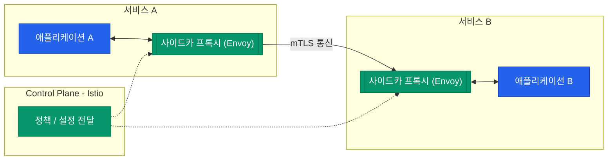

마이크로서비스 아키텍처(MSA)에서 서비스의 개수가 늘어나면 서비스 간 통신(East-West 트래픽) 관리는 재앙이 됩니다. 재시도 로직, 타임아웃, 보안, 모니터링 기능을 모든 앱 코드에 일일이 구현할 수는 없기 때문입니다. 이 문제를 인프라 계층에서 해결해 주는 솔루션이 바로 **서비스 메시**(Service Mesh)입니다

## 사이드카(Sidecar) 아키텍처

서비스 메시의 핵심은 애플리케이션 옆에 딱 붙어있는 **사이드카 프록시**입니다. 모든 들어오고 나가는 트래픽은 이 프록시를 거치게 됩니다

- **데이터 플레인 (Data Plane)**: 실제 패킷을 전달하고 제어하는 프록시들의 집합입니다. 대표적으로 **Envoy**가 사용됩니다
- **제어 플레인 (Control Plane)**: 프록시들에게 설정과 정책을 전달하는 관제 센터입니다. 대표적으로 **Istio**가 이 역할을 합니다

## 서비스 메시가 제공하는 3대 기능

애플리케이션 코드를 수정하지 않고도 다음과 같은 강력한 기능을 얻을 수 있습니다

### 1. 트래픽 관리 (Traffic Control)
- **카나리 배포**: 트래픽의 5%만 새 버전으로 보내기
- **서킷 브레이커**: 장애가 발생한 서비스로의 요청을 즉시 차단하여 연쇄 장애 방지
- **재시도 및 타임아웃**: 통신 실패 시 자동 재시도 로직 수행

### 2. 보안 (Security)
- **mTLS (Mutual TLS)**: 서비스 간 통신을 자동으로 암호화하고 서로의 신원을 확인합니다
- **인가 정책**: 특정 서비스만 특정 API에 접근할 수 있도록 세밀하게 제어합니다

### 3. 관측성 (Observability)
- **분산 트레이싱**: 요청이 어떤 서비스들을 거쳐갔는지 추적합니다
- **메트릭 수집**: 응답 시간, 에러율, 트래픽 양 등을 자동으로 수집하여 대시보드로 시각화합니다

## 데이터 플레인의 주인공: Envoy Proxy

Istio와 같은 서비스 메시에서 가장 널리 쓰이는 데이터 플레인 구현체는 **Envoy**입니다. C++로 작성되어 매우 빠르며, L7 계층의 복잡한 필터링과 라우팅을 수행하는 데 최적화되어 있습니다

| 구분 | 기존 방식 (Library) | 서비스 메시 방식 (Sidecar) |
|---|---|---|
| **구현 위치** | 앱 코드 내부 (Hystrix 등) | 인프라 계층 (Proxy) |
| **언어 의존성** | 언어별 라이브러리 필요 | 모든 언어에 공통 적용 가능 |
| **운영 부담** | 앱 재배포 시 설정 변경 필요 | 런타임에 동적 정책 변경 가능 |

  
도입 전 고려사항: 오버헤드

  서비스 메시는 공짜가 아닙니다. 모든 패킷이 프록시를 두 번(송신측, 수신측) 거치기 때문에 미세한 지연 시간(Latency)과 추가적인 CPU/메모리 리소스 소모가 발생합니다. 서비스 규모가 작다면 과유불급일 수 있습니다

## 정리

- 서비스 메시는 마이크로서비스 간 통신을 관리하는 인프라 계층입니다
- 사이드카 프록시를 통해 앱 수정 없이 보안, 트래픽 제어, 관측성을 확보합니다
- Istio와 Envoy는 현대 클라우드 네이티브 환경의 표준적인 조합입니다

다음 글에서는 '아무도 믿지 않는다'는 원칙 아래 네트워크 보안을 재정의하는 **Zero Trust 네트워크**를 다뤄봅니다
