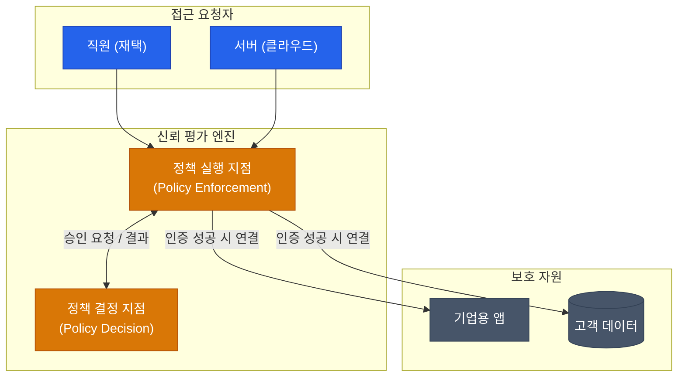

과거의 네트워크 보안은 성벽을 쌓는 것과 같았습니다. 방화벽이라는 성벽을 세우고, 그 안(내부망)에 있는 사람은 믿고 밖(외부망)에 있는 사람은 막는 방식이었습니다. 하지만 클라우드와 원격 근무가 일상이 된 지금, 더 이상 안전한 '내부'는 존재하지 않습니다. 이 새로운 시대의 보안 철학이 바로 **제로 트러스트**(Zero Trust)입니다

## 제로 트러스트의 핵심 원칙: "Never Trust, Always Verify"

제로 트러스트는 사용자가 어디에 있든, 어떤 기기를 사용하든 **무조건 신뢰하지 않는 것**에서 시작합니다

1. **모든 자원에 대한 접근 제어**: 내부망에 있다고 해서 다른 서버에 무조건 접속할 수 없습니다
2. **최소 권한 원칙 (Least Privilege)**: 업무에 꼭 필요한 최소한의 권한만 부여합니다
3. **지속적인 검증**: 한 번 로그인했다고 끝이 아니라, 접속할 때마다 신원과 기기 상태를 다시 확인합니다
4. **모든 트래픽 로깅 및 분석**: 모든 활동을 기록하고 이상 징후를 실시간으로 감시합니다

## 제로 트러스트 아키텍처 (ZTA)

전통적인 방식과 제로 트러스트 방식의 결정적인 차이는 '접근 승인'의 위치에 있습니다

- **ID 기반 보안**: IP 주소가 아닌 '누구인가'를 기반으로 접근을 허용합니다
- **마이크로 세그멘테이션 (Micro-segmentation)**: 네트워크를 아주 잘게 쪼개어, 설령 한 곳이 뚫리더라도 다른 곳으로 공격이 퍼지는 것(Lateral Movement)을 막습니다

## ZTNA vs VPN

기존의 VPN을 대체하고 있는 기술이 **ZTNA**(Zero Trust Network Access)입니다

| 구분 | VPN (Virtual Private Network) | ZTNA (Zero Trust Network Access) |
|---|---|---|
| **보안 모델** | 경계 기반 (내부는 무조건 신뢰) | 자원 기반 (매 접속마다 검증) |
| **가시성** | 연결 후 모든 내부망 탐색 가능 | 허가된 특정 애플리케이션만 보임 |
| **사용자 경험** | 속도가 느리고 끊기기 쉬움 | 클라우드 환경에 최적화되어 빠름 |
| **관리 단위** | 네트워크 대역 (IP) | 사용자 및 앱 단위 |

## 구현을 위한 핵심 기술 요소

- **IAM (Identity & Access Management)**: 강력한 신원 확인 (MFA 등)
- **장비 상태 확인**: 보안 패치가 되어 있는지, 탈옥된 기기는 아닌지 검사
- **SASE (Secure Access Service Edge)**: 네트워크 보안 기능을 클라우드 엣지에서 제공하는 통합 서비스 모델

  
보안은 기술이 아닌 문화입니다

  제로 트러스트를 도입하면 초기에는 사용자가 불편함을 느낄 수 있습니다. 하지만 한 번의 실수로 기업 전체가 마비되는 리스크를 고려한다면, '불편한 검증'은 현대 비즈니스의 생존을 위한 필수 선택입니다

## 정리

- 제로 트러스트는 '안전한 내부망'이라는 개념을 폐기하는 새로운 보안 패러다임입니다
- 모든 접속 요청을 신원과 상태 기반으로 매번 검증합니다
- VPN의 한계를 넘어 클라우드와 분산 근무 환경에 최적화된 보안을 제공합니다

다음 글에서는 실제 운영 환경에서 발생하는 복잡한 문제를 해결하는 **프로덕션 네트워크 트러블슈팅** 기법을 다뤄봅니다
