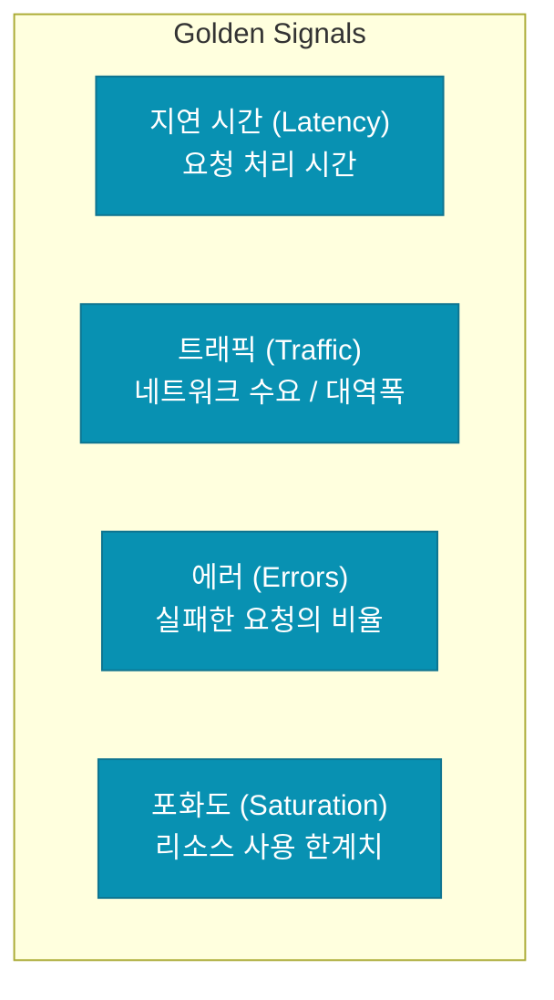

네트워크 규모가 커지고 아키텍처가 복잡해지면 "서버가 살아있다"는 정보만으로는 부족합니다. 장애가 발생한 후 대응하는 것이 아니라, 미세한 징후를 미리 포착하고 근본 원인을 빠르게 파악할 수 있는 시스템이 필요합니다. 이것이 바로 **네트워크 관측성**(Network Observability)의 목적입니다. Advanced 시리즈의 마지막 글로, 관측성 설계의 핵심 요소를 정리합니다

## 모니터링 vs 관측성

두 용어는 비슷해 보이지만 접근 방식이 다릅니다

- **모니터링 (Monitoring)**: "무엇이 발생했는가?"에 집중합니다. 미리 정의된 대시보드와 알람을 통해 알려진 문제(Known Unknowns)를 확인합니다 (예: CPU 사용량 90% 초과)
- **관측성 (Observability)**: "왜 발생했는가?"에 집중합니다. 시스템의 내부 상태를 외부 출력을 통해 유추하여 예기치 못한 문제(Unknown Unknowns)를 진단합니다

## 관측성의 3대 요소 (The Three Pillars)

1. **메트릭 (Metrics)**: 시간에 따른 수치 데이터입니다. (지연 시간, 에러율, 트래픽 양)
2. **로그 (Logs)**: 특정 시점에 발생한 이벤트의 기록입니다. (방화벽 차단 로그, 접속 로그)
3. **분산 트레이싱 (Tracing)**: 하나의 요청이 여러 서비스를 거쳐가는 전체 경로를 추적합니다

## 현대적인 네트워크 관측성 기술

전통적인 SNMP 방식으로는 현대적인 클라우드 환경을 감당할 수 없습니다. 최근에는 다음과 같은 기술들이 주류를 이룹니다

### 1. eBPF (extended Berkeley Packet Filter)
커널 코드를 수정하지 않고도 커널 내부에서 일어나는 네트워크 이벤트를 안전하고 효율적으로 캡처할 수 있는 혁신적인 기술입니다. 성능 저하 거의 없이 세밀한 패킷 추적이 가능합니다

### 2. Flow Logs (VPC Flow Logs)
IP 트래픽의 메타데이터(출발지/목적지 IP, 포트, 패킷 수 등)를 기록합니다. 보안 분석과 비용 최적화의 기초 자료가 됩니다

### 3. OpenTelemetry (OTel)
메트릭, 로그, 트레이싱 데이터를 수집하고 전송하기 위한 표준 프레임워크입니다. 특정 벤더에 종속되지 않고 관측성 데이터를 통합 관리할 수 있게 해줍니다

## 효과적인 대시보드 구성 (Golden Signals)

네트워크 관측성을 위해 반드시 시각화해야 하는 4가지 핵심 지표입니다

## 관측성 설계 시 고려 사항

- **데이터 샘플링**: 모든 데이터를 다 수집하면 저장 비용과 부하가 너무 커집니다. 중요한 데이터만 영리하게 골라내는 샘플링 전략이 필요합니다
- **상관관계 분석**: 로그와 메트릭, 트레이싱 데이터를 하나의 타임라인에서 연결해서 볼 수 있어야 원인 파악이 빠릅니다
- **알람 피로도 관리**: 너무 잦은 알람은 엔지니어를 지치게 합니다. 정말 조치가 필요한 '유의미한 알람'만 발생하도록 정교하게 설계해야 합니다

  
시리즈를 마치며

  네트워크는 더 이상 하드웨어 장비의 집합이 아닙니다. 코드로 정의되고(SDN), 소프트웨어로 관리되며(Service Mesh), 데이터로 증명(Observability)되는 영역으로 진화했습니다. 이 시리즈가 여러분의 탄탄한 네트워크 지식의 밑거름이 되었기를 바랍니다

## 정리

- 관측성은 복잡한 시스템의 내부 문제를 진단하기 위한 필수 역량입니다
- 메트릭, 로그, 트레이싱을 통합하여 입체적인 시각을 확보해야 합니다
- eBPF와 OpenTelemetry 같은 최신 기술을 활용하여 성능 저하 없는 관측 시스템을 구축합니다

이상으로 **Network Advanced (10편)** 시리즈를 모두 마칩니다. 읽어주셔서 감사합니다
