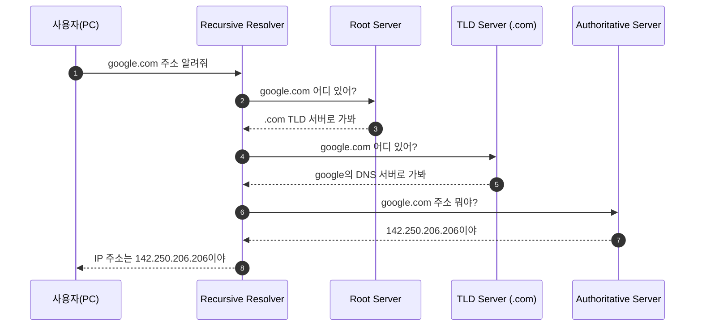

우리가 브라우저 주소창에 `google.com`을 입력할 때, 컴퓨터는 이 이름을 이해하지 못합니다. 컴퓨터는 숫자로 이루어진 IP 주소만을 알고 있기 때문입니다. 이 사이의 가교 역할을 하며 이름을 주소로 바꿔주는 시스템이 바로 **DNS**(Domain Name System)입니다

## DNS의 계층적 구조

DNS는 전 세계에 흩어져 있는 수많은 서버가 협력하는 **계층형 분산 데이터베이스**입니다. 도메인 이름의 계층에 따라 관리 주체가 나뉩니다

- **Root DNS 서버**: DNS 계층의 최상위 서버입니다. TLD 서버의 위치를 안내합니다
- **TLD(Top-Level Domain) 서버**: `.com`, `.net`, `.org`와 같은 최상위 도메인을 관리합니다
- **Authoritative(권한 있는) DNS 서버**: 실제 도메인의 IP 정보를 가지고 있는 최종 목적지입니다
- **Recursive(재귀적) Resolver**: 사용자의 요청을 받아 위 서버들을 차례로 방문하며 답을 찾아주는 가이드 역할을 합니다

## 도메인 이름의 구성: FQDN

도메인 이름은 오른쪽에서 왼쪽으로 갈수록 하위 계층을 의미합니다. 전체 구조를 명확히 표현한 이름을 **FQDN**(Fully Qualified Domain Name)이라고 부릅니다

| 계층 | 예시 | 설명 |
|---|---|---|
| **Root** | `.` | 모든 도메인의 끝에 생략된 마침표 |
| **TLD** | `com` | 최상위 도메인 |
| **SLD** | `google` | 차상위 도메인 (사용자가 등록한 이름) |
| **Subdomain** | `www` | 특정 서비스나 호스트를 지칭 |

## DNS 쿼리 과정: 재귀적 쿼리 흐름

사용자가 주소를 입력했을 때 IP를 찾아가는 과정은 '재귀적 쿼리'와 '반복적 쿼리'의 조합으로 이루어집니다

사용자는 Resolver에게 한 번만 물어보지만(재귀적), Resolver는 여러 서버를 직접 방문하며 답을 구합니다(반복적)

## 주요 DNS 레코드 종류

DNS는 단순히 IP 주소만 저장하는 것이 아니라, 다양한 목적의 정보를 **리소스 레코드**(Resource Record) 형태로 관리합니다

| 레코드 | 설명 | 용도 |
|---|---|---|
| **A** | 도메인을 IPv4 주소로 매핑 | 가장 기본적인 주소 연결 |
| **AAAA** | 도메인을 IPv6 주소로 매핑 | 차세대 IP 주소 연결 |
| **CNAME** | 도메인에 대한 별칭 지정 | `blog.site.com`을 `site.com`으로 연결 |
| **MX** | 메일 수신 서버 지정 | 이메일 서비스 연동 |
| **TXT** | 텍스트 정보 저장 | 소유자 인증, 보안 설정(SPF/DKIM) |

## DNS 캐싱과 TTL

모든 요청을 매번 Root 서버부터 찾아가면 인터넷 속도가 매우 느려질 것입니다. 이를 해결하기 위해 **캐싱**(Caching)을 사용합니다

- **Recursive Resolver 캐싱**: 이전에 찾은 결과를 일정 시간 보관합니다
- **브라우저/OS 캐싱**: 사용자의 컴퓨터 내부에서도 최근 접속한 주소를 기억합니다
- **TTL(Time To Live)**: DNS 레코드가 캐시에 머물 수 있는 유효 시간을 의미합니다. TTL이 길면 서버 부하가 줄지만, IP 변경 시 전파 속도가 느려질 뿐입니다

  
보안의 핵심: DNSSEC

  DNS는 설계 당시 보안보다 효율성을 중시했기에 데이터 위조에 취약합니다. 이를 보완하기 위해 디지털 서명을 추가한 <b>DNSSEC</b> 기술이 도입되어 데이터의 신뢰성을 보장합니다

## 정리

- DNS는 도메인 이름을 IP 주소로 바꾸는 분산 데이터베이스 시스템입니다
- Root, TLD, Authoritative 서버가 계층적으로 정보를 관리합니다
- 효율성을 위해 계층별 캐싱과 TTL 설정을 활용합니다

다음 글에서는 우리가 매일 사용하는 웹 프로토콜인 **HTTP/1.1과 HTTP/2**의 차이를 분석합니다
