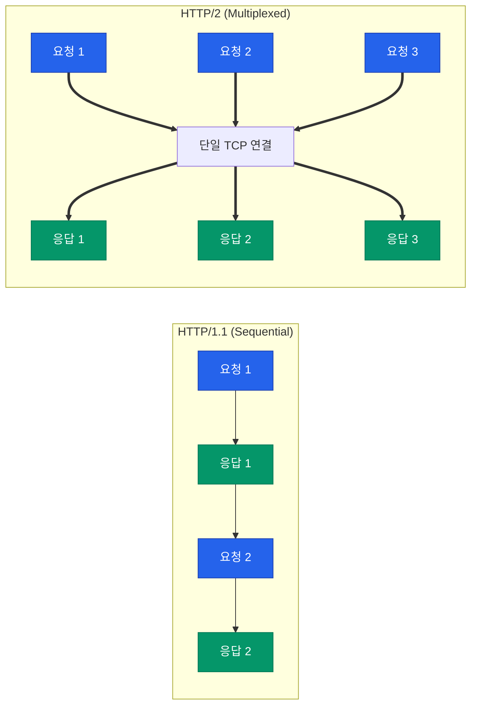

우리가 매일 사용하는 웹 서비스의 속도는 단순히 서버 성능에만 의존하지 않습니다. 데이터를 주고받는 방식인 **HTTP** 프로토콜의 효율성이 사용자 경험을 결정짓는 핵심 요소입니다. 오랜 시간 표준이었던 HTTP/1.1과 이를 혁신적으로 개선한 HTTP/2의 차이를 파헤쳐 봅니다

## HTTP/1.1의 한계: HOL Blocking

HTTP/1.1은 기본적으로 한 번에 하나의 요청만 처리할 수 있는 구조입니다. `Keep-Alive`를 통해 연결을 유지하더라도, 이전 요청이 완료되어야 다음 요청을 보낼 수 있습니다

- **HOL(Head-of-Line) Blocking**: 앞선 요청이 늦어지면 뒤에 있는 모든 요청이 대기하게 되는 병목 현상이 발생합니다
- **무거운 헤더**: 매 요청마다 반복되는 쿠키나 User-Agent 정보가 중복 전송되어 대역폭을 낭비합니다
- **비효율적 해결책**: 이를 극복하기 위해 이미지 스프라이트(Image Sprite), 도메인 샤딩(Domain Sharding) 같은 복잡한 트릭을 사용해야 했습니다

## HTTP/2의 혁신: 효율적 전송 아키텍처

2015년에 등장한 HTTP/2는 기존의 텍스트 기반 전송을 **바이너리 프레이밍 계층**(Binary Framing Layer)으로 전환하여 성능을 극대화했습니다

### 1. 멀티플렉싱 (Multiplexing)

단일 TCP 연결 위에서 여러 개의 요청과 응답을 동시에 주고받을 수 있습니다. 스트림(Stream) 단위를 사용하여 데이터를 쪼개어 보내므로 HOL Blocking 문제가 해결됩니다

### 2. HPACK 헤더 압축

허프만 코딩(Huffman Coding)을 사용하여 중복되는 헤더 정보를 압축합니다. 이전 요청과 겹치는 헤더는 생략하고 변경된 부분만 전송하므로 데이터 크기가 비약적으로 줄어듭니다

### 3. 서버 푸시 (Server Push)

클라이언트가 요청하기 전에 서버가 필요한 리소스(CSS, JS 등)를 미리 밀어넣어 줄 수 있습니다. 브라우저가 HTML을 파싱하고 추가 리소스를 요청하는 시간을 단축합니다

## 성능 비교 요약

| 구분 | HTTP/1.1 | HTTP/2 |
|---|---|---|
| **데이터 형식** | 텍스트 (Plain Text) | 바이너리 (Binary) |
| **연결 방식** | 요청당 응답 대기 (순차적) | 멀티플렉싱 (동시 처리) |
| **헤더 처리** | 중복 전송 (무거움) | HPACK 압축 (가벼움) |
| **리소스 우선순위** | 없음 | 지원함 (Stream Priority) |
| **서버 푸시** | 불가능 | 가능 |

## 실제 웹 환경에 주는 변화

HTTP/2의 도입으로 프론트엔드 개발 방식도 변화했습니다. 과거에는 파일을 하나로 묶는 번들링(Bundling)이 필수적이었으나, HTTP/2에서는 여러 개의 작은 파일을 동시에 전송하는 것이 효율적일 수 있어 세밀한 캐싱 전략이 가능해졌습니다

  
여전히 남은 숙제: TCP HOL Blocking

  HTTP/2가 애플리케이션 계층에서의 HOL Blocking은 해결했지만, 하부의 **TCP 계층**에서 발생하는 손실로 인한 지연은 피할 수 없습니다. 이를 해결하기 위해 등장한 것이 UDP 기반의 **HTTP/3**입니다

## 정리

- HTTP/1.1은 순차적 처리 구조로 인해 성능 병목이 발생하기 쉽습니다
- HTTP/2는 멀티플렉싱과 헤더 압축을 통해 전송 효율을 극대화했습니다
- 현대의 고성능 웹 서비스는 대부분 HTTP/2 이상을 기본으로 채택하고 있습니다

다음 글에서는 안전한 웹 통신을 위한 필수 절차인 **TLS 핸드셰이크와 인증서**에 대해 알아봅니다
