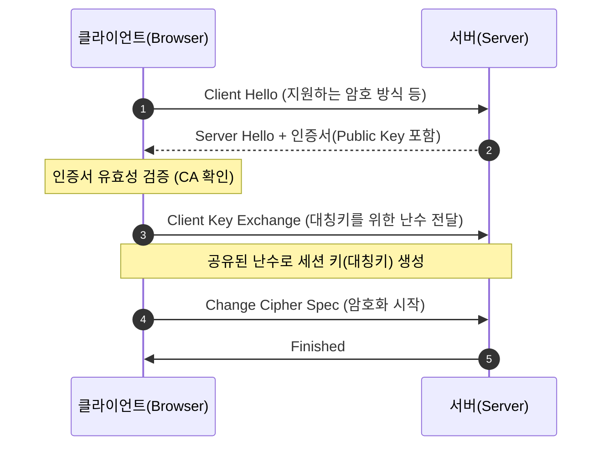

인터넷에서 신용카드 정보를 입력하거나 로그인을 할 때, 우리는 데이터가 도청되지 않을 것이라고 믿습니다. 이 믿음을 기술적으로 보장하는 것이 바로 **TLS**(Transport Layer Security)입니다. 데이터 암호화뿐만 아니라 상대방이 누구인지 확인하는 인증 과정까지, TLS의 핵심 메커니즘을 살펴봅니다

## 암호화의 두 기둥: 대칭키와 공개키

TLS는 성능과 보안이라는 두 마리 토끼를 잡기 위해 두 가지 암호화 방식을 혼합하여 사용합니다

- **대칭키 암호화**: 암호화와 복호화에 같은 키를 사용합니다. 속도가 매우 빠르지만, 키를 안전하게 전달하는 것이 어렵습니다
- **공개키(비대칭키) 암호화**: 공개키(Public Key)로 암호화하고 개인키(Private Key)로 복호화합니다. 키 전달 문제는 해결되지만 연산 비용이 매우 높습니다

TLS는 **공개키 방식으로 안전하게 대칭키를 공유**한 뒤, 실제 데이터 전송은 **빠른 대칭키로 수행**하는 하이브리드 방식을 채택합니다

## TLS 핸드셰이크 과정 (TLS 1.2 기준)

데이터를 주고받기 전, 클라이언트와 서버가 서로를 확인하고 암호화 키를 생성하는 과정을 핸드셰이크라고 부릅니다

TLS 1.3에서는 이 과정이 더 단순화되어, 단 한 번의 왕복(1-RTT)만으로 핸드셰이크가 완료되어 훨씬 빠른 연결 속도를 제공합니다

## 인증서와 CA(Certificate Authority)

서버가 전달한 공개키가 가짜라면 암호화는 무용지물입니다. 서버의 정체를 보증해 주는 신뢰할 수 있는 제3기관이 바로 **CA**입니다

1. **인증서 발급**: 서버 운영자는 자신의 공개키를 CA에 전달하고 서명을 요청합니다
2. **전자 서명**: CA는 서버 정보와 공개키를 자신의 개인키로 암호화하여 '디지털 서명'이 포함된 인증서를 발급합니다
3. **신뢰의 체인**: 브라우저는 이미 알고 있는 CA의 공개키를 사용하여 서버 인증서의 서명을 해독합니다. 해독에 성공하면 이 인증서는 믿을 수 있는 것으로 간주합니다

## 주요 구성 요소 비교

| 구분 | 대칭키 (Symmetric) | 공개키 (Asymmetric) |
|---|---|---|
| **키 개수** | 1개 (공유키) | 2개 (공개키, 개인키) |
| **장점** | 연산 속도가 매우 빠름 | 키 교환이 안전함 |
| **단점** | 키 전달 시 탈취 위험 | 연산 속도가 상대적으로 느림 |
| **TLS 내 역할** | 실제 데이터 암호화 | 핸드셰이크 단계의 키 교환 |

## HTTPS와 TLS의 관계

많은 사람이 HTTPS와 TLS를 혼용하지만, 엄밀히 말하면 **HTTPS는 HTTP 프로토콜 아래에 TLS 계층이 추가된 것**입니다. 데이터 전송 방식은 HTTP와 같지만, 전송로 자체가 TLS에 의해 암호화되어 보호받는 구조입니다

  
왜 TLS 1.3으로 전환해야 할까?

  TLS 1.3은 보안성이 취약해진 오래된 암호 알고리즘들을 제거하고 핸드셰이크 과정을 최적화했습니다. 보안과 성능이라는 두 가지 측면에서 선택이 아닌 필수인 표준입니다

## 정리

- TLS는 공개키와 대칭키 방식을 혼합하여 보안과 성능을 모두 챙깁니다
- 핸드셰이크를 통해 서로의 신원을 확인하고 안전하게 암호화 키를 생성합니다
- 인증서는 신뢰할 수 있는 기관(CA)을 통해 서버의 정당성을 보증합니다

다음 글에서는 네트워크 통신의 실질적인 관문인 **소켓 프로그래밍 기초**에 대해 다뤄봅니다
