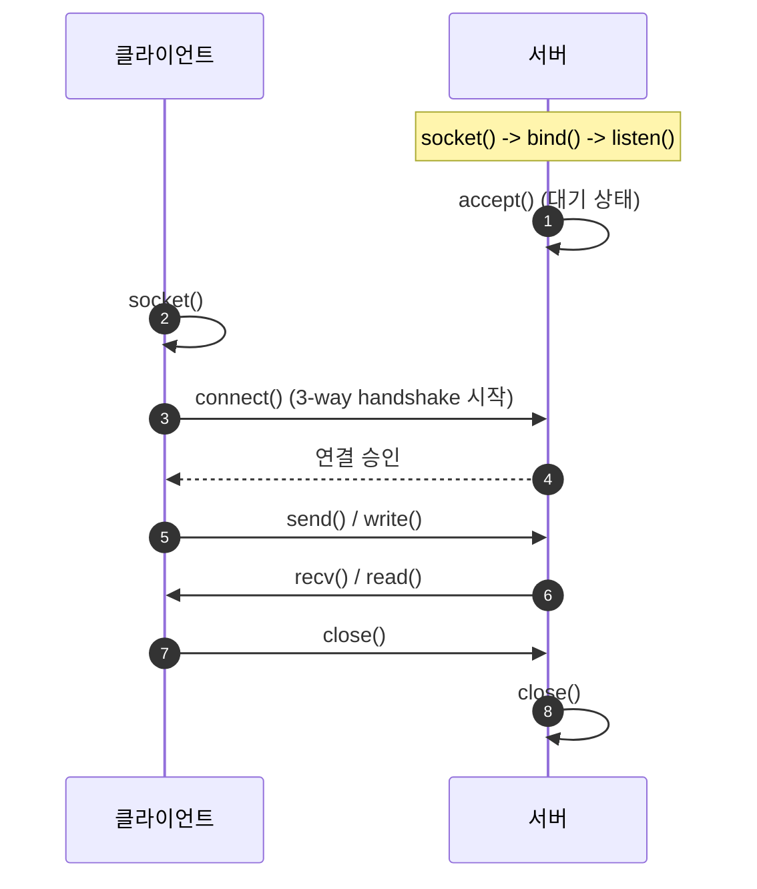

네트워크를 통해 데이터를 보내는 것은 마치 전화기로 대화를 나누는 것과 비슷합니다. 이때 대화의 통로가 되는 장치가 바로 **소켓**(Socket)입니다. 운영체제가 제공하는 이 추상화된 인터페이스를 통해 복잡한 하부 네트워크 계층을 몰라도 데이터를 전송할 수 있습니다

## 소켓이란 무엇인가?

소켓은 네트워크상의 두 프로그램이 양방향 통신을 하기 위한 **엔드포인트**(End-point)입니다. 하나의 소켓은 다음의 정보 조합으로 식별됩니다

- **IP 주소**: 어느 컴퓨터로 보낼 것인가? (호스트 식별)
- **포트 번호**: 그 컴퓨터의 어떤 프로그램으로 보낼 것인가? (프로세스 식별)
- **프로토콜**: 어떤 방식으로 보낼 것인가? (TCP 또는 UDP)

## TCP 소켓 통신 흐름

가장 널리 쓰이는 연결 지향형(TCP) 소켓의 통신 과정은 서버와 클라이언트의 역할이 뚜렷하게 나뉩니다

### 서버 측 주요 API
1. **socket()**: 소켓을 생성합니다
2. **bind()**: 소켓에 IP 주소와 포트 번호를 할당합니다
3. **listen()**: 클라이언트의 접속 요청을 기다리는 상태로 전환합니다
4. **accept()**: 클라이언트의 접속을 수락하고 통신을 위한 새로운 전용 소켓을 반환합니다

### 클라이언트 측 주요 API
1. **socket()**: 소켓을 생성합니다
2. **connect()**: 서버에 접속을 시도합니다

## TCP vs UDP 소켓 비교

| 구분 | TCP 소켓 (Stream) | UDP 소켓 (Datagram) |
|---|---|---|
| **연결성** | 연결 지향 (Connection-oriented) | 비연결형 (Connectionless) |
| **신뢰성** | 데이터 순서 및 전송 보장 | 전송 보장 안 함 |
| **경계** | 데이터 경계 없음 (연속된 바이트) | 메시지 경계 있음 (개별 패킷) |
| **속도** | 상대적으로 느림 | 매우 빠름 |

## 소켓 프로그래밍의 핵심 고려 사항

실제 구현 시에는 단순히 데이터를 보내는 것 이상의 고민이 필요합니다

- **Blocking vs Non-blocking**: 데이터를 읽거나 보낼 때 결과가 나올 때까지 기다릴 것인지, 아니면 바로 다음 작업을 수행할 것인지 결정해야 합니다
- **다중 접속 처리**: 수많은 클라이언트가 동시에 접속할 때 멀티 프로세스, 멀티 스레드, 혹은 I/O 멀티플렉싱(select, epoll 등) 중 어떤 방식을 사용할지가 성능의 관건입니다
- **엔디언(Endian) 변환**: 컴퓨터마다 숫자를 저장하는 방식이 다를 수 있으므로, 네트워크 표준 방식(Big-endian)으로 변환하여 송수신해야 합니다

  
왜 서버 소켓은 두 개일까?

  TCP 서버에서 `listen` 소켓은 '문지기' 역할을 하며 새로운 요청을 받는 데만 집중합니다. 실제 데이터 통신은 `accept`가 반환한 새로운 '전용 소켓'을 통해 이루어집니다. 덕분에 서버는 통신 중에도 다른 손님을 계속 맞이할 수 있습니다

## 정리

- 소켓은 IP와 포트를 결합한 네트워크 통신의 표준 인터페이스입니다
- TCP는 연결-데이터 전송-해제라는 정해진 생명 주기를 따릅니다
- 효율적인 서버를 구축하기 위해서는 다중 접속 처리 모델에 대한 이해가 필수적입니다

다음 글에서는 IPv4 주소 부족 문제를 해결하는 마법인 **NAT와 사설 네트워크**를 마지막으로 Fundamentals 시리즈를 마무리합니다
