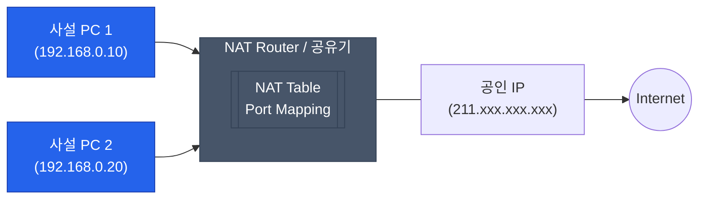

전 세계의 모든 컴퓨터가 각자 고유한 공인 IP 주소를 갖기에는 IPv4 주소(약 43억 개)가 턱없이 부족합니다. 이 한계를 극복하고 수많은 내부 기기를 인터넷에 연결해 주는 기술이 바로 **NAT**(Network Address Translation)입니다. 우리 집 공유기 내부에서 일어나는 신비로운 주소 변환의 세계를 살펴봅니다

## 공인 IP와 사설 IP

인터넷 환경은 크게 외부 세계인 공인망과 내부 세계인 사설망으로 구분됩니다

- **공인 IP(Public IP)**: 인터넷상에서 유일하게 식별되는 주소입니다. ISP(통신사)로부터 할당받습니다
- **사설 IP(Private IP)**: 특정 로컬 네트워크 내부에서만 유효한 주소입니다. 외부 인터넷에서는 직접 접근할 수 없습니다

### 사설 IP 대역 (RFC 1918 표준)
| 클래스 | 사설 IP 주소 범위 | 설명 |
|---|---|---|
| **Class A** | `10.0.0.0` ~ `10.255.255.255` | 대규모 네트워크용 |
| **Class B** | `172.16.0.0` ~ `172.31.255.255` | 중규모 네트워크용 |
| **Class C** | `192.168.0.0` ~ `192.168.255.255` | 가정 및 소규모 사무실용 |

## NAT의 동작 원리: 주소 변환의 마법

NAT는 사설 IP를 가진 기기가 외부로 나갈 때, 게이트웨이(공유기 등)의 공인 IP로 주소를 바꿔서 내보냅니다

단순히 주소만 바꾸면 돌아오는 패킷이 누구 것인지 알 수 없습니다. 이를 해결하기 위해 포트 번호를 함께 사용하는 **PAT**(Port Address Translation) 방식을 주로 사용합니다. 공유기는 내부 포트와 외부 포트의 매핑 정보를 'NAT Table'에 기록하여 응답을 원래 주인에게 전달합니다

## NAT를 사용하는 이유

단순히 주소 부족 문제 해결 이상의 장점이 있습니다

1. **IPv4 주소 절약**: 하나의 공인 IP로 수백 대의 기기를 수용할 수 있습니다
2. **보안 강화**: 외부에서 내부 사설망의 실제 주소를 알 수 없으므로 직접적인 공격을 방어하는 방화벽 역할을 합니다
3. **유연한 관리**: 인터넷 회선 변경이나 내부 네트워크 재구성이 용이합니다

## NAT의 한계와 극복

NAT 내부의 서버에 외부 사용자가 접속하고 싶을 때는 어떻게 할까요?

- **포트 포워딩(Port Forwarding)**: 외부의 특정 포트로 들어오는 요청을 내부의 특정 IP/포트로 고정해서 넘겨주는 설정입니다
- **DMZ**: 특정 기기를 외부 인터넷에 완전히 노출하여 모든 포트의 요청을 받게 합니다
- **NAT Traversal**: P2P 게임처럼 복잡한 네트워크 환경에서 서로를 찾아야 할 때 사용하는 기술들(STUN, TURN 등)이 있습니다

  
IPv6 시대에는 NAT가 필요 없을까?

  IPv6는 거의 무한대에 가까운 주소를 제공하므로 이론적으로는 NAT 없이 모든 기기에 공인 IP를 줄 수 있습니다. 하지만 보안상의 이유로 여전히 주소를 숨기는 방식이 선호되기도 합니다

## 정리

- NAT는 사설 IP와 공인 IP 사이의 변환을 담당하는 필수 기술입니다
- PAT를 통해 포트 번호로 여러 기기를 동시에 식별합니다
- 주소 절약뿐만 아니라 내부망을 보호하는 보안 계층으로 기능합니다

이것으로 Network Fundamentals 시리즈를 마칩니다. 다음 시리즈인 **Network Advanced**에서는 글로벌 트래픽 처리와 차세대 프로토콜 등 더 깊은 주제로 돌아옵니다
