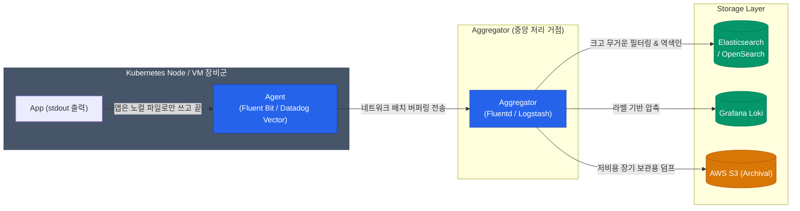

서버 수백 대에서 매초 수십만 줄씩 격렬하게 쏟아져 나오는 로그 파일들을 애플리케이션이 직접 중앙 DB 인덱서로 네트워크 요청을 보내 저장하게 엮는다면, 커넥션 과부하로 앱 자체가 응답 불능(OOM, Timeout)에 빠질 수 있습니다

장애로부터 서비스 메인 스레드를 견고하게 지키기 위해, 모던 인프라 환경은 **Agent(경량 수거원) → Aggregator(중앙 집하장) → Storage(최종 검색 창고)**라는 분업화 패턴을 수립합니다

## 3단계 파이프라인의 물리적 분리

### 1단계: Agent (경량화 수거원)
애플리케이션은 네트워크 스토리지 통신 연결을 전혀 알 필요 없이, 그냥 콘솔 화면(표준 출력, `stdout`)에 로깅 텍스트를 던져버리고 비즈니스 로직에만 충실합니다 
그러면 물리 서버 데몬으로 숨어 떠 있는 **Fluent Bit**나 최근 모던 인프라에서 각광받는 극강의 Rust 성능 **Vector**가 노드 로컬 로그 파일의 꼬리(tail)를 스윕합니다. 이놈들은 C/Rust 언어로 짜여져 CPU와 Memory를 극도로 아끼며 오직 수집과 버퍼링 배달에만 목적을 둡니다

### 2단계: Aggregator (중앙 통제소)
수많은 에이전트 군대가 쏘아대는 무수한 네트워크 트래픽 요청을 단일한 **중앙 우체국** 플랫폼인 **Logstash**나 **Fluentd** 허브가 다 받아 흡수합니다. 이 계층은 Java, Ruby 기반이라 리스소 부피는 좀 무겁지만, 로그를 가공하거나 "이 보안 로그는 KST 시간대로 치환해서 S3 창고 백업으로 격리시키고, 저 웹 로그는 엘라스틱으로 보내라!"라는 복잡한 다중 라우팅 분기 규칙(Filter/Grok)을 다루고 뒷단 부하를 분산시키는 데 최적화되어 있습니다

### 3단계: Storage (분석 쿼리 창고)
파이프라인의 최종 종착지는 데이터를 인덱싱하고 엔지니어에게 시각과 검색창을 제공하는 공간입니다
방대한 텍스트 스캔 검색에 최고 존엄인 클래식 **Elasticsearch (ELK 생태계)**가 널리 쓰여왔으나, 최근에는 내용을 전부 인덱스에 태우지 않고 오직 가벼운 메타 라벨(Pod명, Namespace명)에만 인덱스를 걸어 스토리지를 극단적으로 절약하는 타협안 **Grafana Loki**가 무서운 가성비를 무기 삼아 대안으로 안착 중입니다

  
에이전트 배치 방식: 사이드카(Sidecar) vs 데몬셋(DaemonSet)

  수거원 에이전트를 K8s 클러스터 어디에 붙일까요?  
  1. <strong>DaemonSet 정석 패턴</strong>: 노드(서버 머신) 당 딱 1개씩 띄웁니다. 이 한 명이 노드 내 모든 컨테이너들의 공용 로그 풀을 다 쓸어담으므로 <strong>운영 체계가 극단적으로 간소화되고 중복 비용을 덜어내 베스트 프랙티스로 불립니다.</strong> 
  2. <strong>Sidecar 예외 패턴</strong>: 메인 앱 Pod 옆에 1:1 로컬 수거원 보좌관을 붙입니다. 글로벌 로깅 포맷과 충돌하거나 로깅 팩토리 관리가 파편화되어 무거워지기도 하지만, <strong>보안 규정이 까다로워 내 앱 로그 파이프라인만 격리 독재하고 완전히 분리하려 할 때</strong> 특정 부서 단위로 사용되기도 합니다

## 정리 요약

- 애플리케이션의 본질은 API 응답 로직 처리입니다. **표준 출력(stdout)** 패러다임으로 로그 출력을 위임하여 커넥션 장애 위험으로부터 격리하세요
- 각 서비스 노드 마다 **Fluent Bit나 Vector** 같은 초경량 C/Rust 계열 Agent 파이프라인만 배치해 고가용성 컴퓨팅 리소스 낭비를 막으세요
- 방대한 양의 로깅 트래픽 라우팅을 병렬로 다룰 땐 중앙 망에 **Aggregator(Fluentd) 층**을 두어 외부 스토리지 병목 부담을 백프레셔(Backpressure) 버퍼로 완화하세요

이토록 흩어진 수십억 개의 로그가 결국 시간이 지남에 따라 몇백 테라바이트급 비용 영수증 폭탄으로 돌아오지 않도록 막아내야 합니다. 다음 포스트에서는 스토리지 방어를 위한 **ILM 보존 정책(Retention)과 비용 최적화 계층화** 구조를 관철해봅니다
