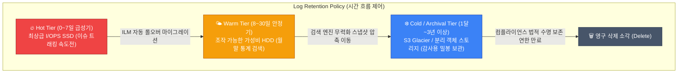

"갑자기 규제가 빡세졌어. 3달 전 결제 장애 났던 날짜의 원본 로그 좀 다 뽑아줄래?"
아무리 꼼꼼하게 구조화된 로깅 파이프라인을 사내에 안착시켰어도 아키텍트의 현실적인 고민거리는 남습니다. 로그는 수집 직후엔 뜨겁지만 시간이 약간만 지날수록 데이터 파편의 가치가 0으로 미친 듯이 수렴합니다. 반대로 AWS 스토리지 청구 요금은 무한 누적될수록 잔인하게 우상향 하죠.

**검색의 자유로움도(Searchability)**와 인프라의 잔혹한 **유지 가용 비용(Cost)**이라는 지독한 트레이드오프 양립을 타개하기 위한 검색 엔진 선택 및 보존 수명 정책을 파헤쳐 짚어봅니다.

## 검색 엔진 아키텍처의 차이: Lucene 철학 vs LogQL 

로그를 인덱싱 쿼리하기 전, 중앙 스토리지 본거지가 어느 근본적 기술 기반을 쓰냐에 따라 속도 체감과 인프라 파산 성격이 180도 갈라집니다.

1. **Elasticsearch 방식 (Lucene 기반 텍스트 전체 풀 색인)**
   - "최근 일주일 치 장바구니에 담긴 내역 중 'iPhone 15' 텍스트를 포함해 반품된 계정 ID를 모조리 다 찾아줘!" 같은 강력한 풀텍스트 키워드 스캔형 서치에 절대적 우위를 범합니다.
   - 단점의 늪: 모든 토큰 단어 조각의 색인 포인터를 디스크에 개별로 무식하게 생성하므로, 실제 날것의 원본 로그 텍스트 원문 대비 스토리지 용량을 **거의 2배~3배 이상으로 거대하게 폭파**시킵니다. 즉, 유지 인프라 비용이 극도로 비쌉니다.

2. **Grafana Loki 방식 (Prometheus 통일 계보형 LogQL 라벨 색인)**
   - 로그 텍스트의 본문 내용은 일절 인덱싱을 거부하고 무식한 압축 바이너리 텍스트 덩어리로 뭉쳐 처박아 놓습니다. 대신 가벼운 **메타 환경 꼬리표**(유니크한 라벨 배열: `app="payment-api", region="ap-northeast-2", env="prod"`) 메타데이터 딱지만 색인 배열로 올립니다.
   - 대시보드 쿼리를 날렸을 때 그때서야 라벨로 대상을 확 좁힌 뒤 그 블록 내에서만 무식한 직관 텍스트 정규식 검색을 돌리는 전략입니다. 속도는 ES보다 약간 답답해도, 엄청난 압축률 덕분에 엘라스틱서치 대비 인프라 디스크 스토리지 비용을 기하급수적으로 **최대 1/4 가량 절약**해 줍니다. 

## Hot-Warm-Cold 스토리지 수명 유지 계층화 

법적 규제 컴플라이언스(보안 심사 및 ISMS 인증 등)의 허들 때문에 무조건 금융 개인 로그를 1년 혹은 최소 3년 이상 좀비처럼 보관해야만 하는 엔터프라이즈 환경이 허다합니다. 이 무자비한 페타바이트급 블록들을 매일같이 비싼 최고급 I/O 프로비저닝 SSD 장비에 영구적으로 쌓아 방치하다 보면, 1년 뒤엔 클라우드 인프라 청구서 파산 사태가 명확히 일어납니다.

이를 피하기 위해 돌파하는 시스템 아키텍처가 철저한 **스토리지 Tiering (계층화 수명 주기 생태계)** 메커니즘입니다.

- 엘라스틱서치 등의 **ILM (Index Lifecycle Management)** 자동화 컨트롤 기능을 이용해 클러스터 노드 정책을 겁니다. 발생 직후 가장 검색 빈도와 시급성이 치솟는 첫 일주일 구간 7일간은 득달같이 에러 근원지를 파헤치기 위해 가장 빠르고 과금률이 비싼 고속 노드 티어(Hot)에 배치합니다.
- 장애가 종료되고 한 달이 이미 지나버린 로그는 현장 운영자의 즉시 조회 검색 요구가 0%로 급감하며, 오직 이따금씩 경영진과 감사원 컴플라이언스(법적 장기 보존 의무율)를 증명하기 위해서만 물리적으로 존재합니다. 이때부터 비싼 검색 인덱스(쿼리 그물망)를 다 지워 검색 기능을 무력화시킨 채 압축 타르(Tar)율만 최대한 높여 값싼 AWS S3 기반의 **오브젝트 객체 스토리지 아카이빙(Cold/Glacier)**으로 냉동시켜 처박아둡니다.

  
로깅 샘플링 (Dynamic Sampling) 전략 타협: "정말 100%를 다 받아야만 안심할까?"

  성공적인 'HTTP 200 OK 결제 통과' 상태의 거시적인 무지성 엑세스 트래픽 핑 로그 라인까지 꾸준히 100% 다 요금이 나가는 중앙 저장소 버킷에 처넣을 필요가 있을까요? <strong>다이내믹 샘플링(Dynamic Sampling)</strong> 알고리즘을 타협점으로 앞단 파이프라인에 적극 도입하세요. 
  "아주 정상적인 로그는 표본 통계만 보게 확률 10% 비율로만 추출 필터링을 걸어서 저장소로 넘기고, 만약 ERROR 레벨 가중치가 포함된 불길한 로그 스트림은 즉각 예외 라우팅으로 분류해 유실 없이 100% 저장 창고로 통과시켜라!" 같은 수집기 필터 규칙을 최전방에서 선언해놓으면 통계 보존 신뢰도는 챙기되 트래픽 비용 절약 폭주 마비를 막는 마법이 펼쳐집니다.

## 정리 요약 지침

- 복합적인 평문 내역의 텍스트 검색 추적이 빈번한 e커머스 등이라면 돈이 들어도 묵직한 **Elasticsearch**를, 반대로 클라우드 클러스터 유지 볼륨 예산을 극적으로 아끼고 빠른 K8s 환경 라벨 기반 조회가 더 우선순위라면 **Loki** 생태계 전환을 먼저 채택하세요.
- 비싼 티어의 스토리지가 무의미하게 말라비틀어지는 낭비를 방어하기 위해, **가장 최신 분초를 다투는 로그는 SSD(Hot), 이미 낡은 지난 오래된 로그 데이터는 즉각 S3(Cold/Archive 객체 보관)**로 자동 롤오버 이동시키는 수명 주기 자동화 시스템 인프라 구축(ILM / Data Retention)을 필히 사전 세팅해두세요.
- 이벤트 타임 세일에 트래픽이 미친 듯이 감당 안되게 치솟을 조짐이 보일 때는, 멀쩡한 정상 응답 로그 한정으로 **다이내믹 샘플링(추출) 기법**을 긴급 수동 트리거로 적용해 추세를 모니터할 전반적 통계 데이터의 신뢰성만은 살려 남기고 당장의 급한 저장 디스크 공간 파산 비용과 서버 I/O 과부하를 반갈죽 무력화시켜 버리세요.

이렇게 인프라와 앱 메트릭을 모니터링하고 파이프라인으로 구조화 로그 텍스트까지 중앙 서버로 모았습니다. 허나 얽히고설킨 수십 개의 MSA 서버 컨테이너 간의 통신 핑퐁 사이에서 "도대체 정확히 중간에 낀 어느 API 통로망이 렉이 걸려 느려진 거야?"를 시각적으로 단방에 범인 잡듯 짚어내기엔 단순 서버 지표와 텍스트 파일 로그만으로는 2% 부족한 병목의 한계에 부딪힙니다. 그 마지막 미싱 링크 나머지 퍼즐을 그림으로 직관적으로 전부 채워줄 종착지 메커니즘, **분산 추적(Distributed Tracing)** 생태계를 다음 파트에서 마주해보겠습니다.
