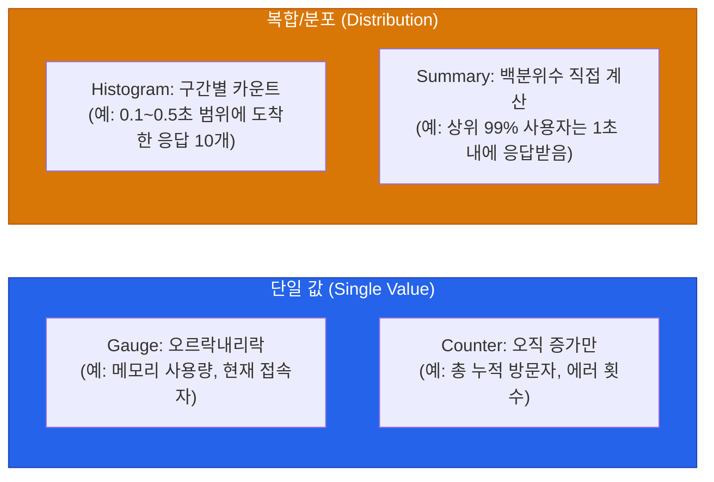

우리가 운영하는 서버나 서비스를 들여다볼 때, "지금 멀쩡한가?"를 숫자로 정량화한 것이 바로 **메트릭(Metrics)**입니다. 하지만 무작정 쌓기만 한 메트릭은 데이터 쓰레기일 뿐, 장애 발생 시 원인을 찾는 데 아무런 도움이 되지 않아요

무엇을 어떻게 수집해야 의미 있는 모니터링이 될 수 있는지, 그 기준이 되는 프레임워크와 측정 타입을 살펴봅니다

## 메트릭 수집을 위한 3대 프레임워크

대규모 분산 시스템을 파헤치며 수많은 장애를 겪은 선배 엔지니어들(Brendan Gregg, Google SRE 등)이 "이것만큼은 꼭 수집해라"라고 정리한 3가지 대표적인 방법론이 있어요

### 1. USE Method (인프라 관점)
주로 인프라(CPU, Memory, Disk, Network) 자원의 병목을 찾기 위해 사용해요
- **U**tilization (사용률): 자원이 얼마나 바쁘게 일하고 있는가? (예: CPU 80% 사용)
- **S**aturation (포화도): 처리하지 못하고 줄 서서 대기하는 작업이 있는가? (예: CPU Run Queue Length)
- **E**rrors (에러): 물리적/논리적 오류가 발생하고 있는가? (예: 네트워크 인터페이스 에러 수)

### 2. RED Method (서비스 관점)
마이크로서비스(MSA)와 같이 리퀘스트를 주고받는 애플리케이션 계층에 적용하는 원칙이에요
- **R**ate (처리율): 초당 얼마나 많은 요청이 들어오는가? (예: 50 requests/sec)
- **E**rrors (에러율): 전체 요청 중 실패한 요청의 비율은 얼만가? (예: HTTP 500 에러 발생 비율)
- **D**uration (소요 시간): 하나의 요청을 처리하는 데 얼마나 걸렸는가? (응답 시간, Latency)

### 3. Google's 4 Golden Signals (SRE 관점)
구글이 SRE 워크북에서 제시한 가장 포괄적이고 강력한 방법론이에요. RED에 Saturation을 섞은 형태에 가깝습니다
- **Latency (지연 시간)**
- **Traffic (트래픽 / 호출량)**
- **Errors (오류율)**
- **Saturation (시스템 포화도)**

  
왜 3가지를 다 알아야 할까요?

  애플리케이션 개발자는 보통 <strong>RED Method</strong>로 API 상태를 보고, 인프라 엔지니어는 <strong>USE Method</strong>로 장비를 봅니다. 이 둘을 통합하여 서비스 전체의 사용자 경험(UX) 직결 상태를 정의하는 기준이 바로 <strong>4 Golden Signals</strong>입니다. 알람을 걸 때 이 신호들을 벗어난 메트릭을 잡으면 오탐(False Positive)을 극단적으로 줄일 수 있어요

## Prometheus 메트릭 4가지 타입

이러한 수치들을 시스템에서 추출할 때, 가장 널리 쓰이는 표준인 Prometheus 계열은 데이터 타입을 4가지로 나눕니다

- **Gauge**: 고정된 값이 아니라 언제든 오르내릴 수 있는 현재 상태 찰칵!
- **Counter**: 앱이 재시작되기 전까지 절대 줄어들지 않고 누적되는 총량 
  - *주의: Counter 값 그 자체보단 `rate()` 함수로 "초당 증가율"을 구하는 게 진짜 목적이에요.*
- **Histogram & Summary**: 평균의 함정(빠른 99개와 느린 1개가 섞여 다 괜찮아 보이는 현상)을 피하기 위해 뭉뚱그리지 않고 요청들을 지연 시간 구간(Bucket)에 나눠 담아요. (P99, P95 분포 계산용)

## 라벨과 네이밍 컨벤션

`http_requests_total{status="200", method="GET", path="/api/v1/users"}`

메트릭을 설계할 때 숫자의 이름은 짧게 가져가고, 세부 속성들은 반드시 **라벨(Label)**로 부여해야 합니다. 만약 저걸 `http_requests_500_get_users` 처럼 하나의 긴 문자열로 만든다면, 나중에 "전체 HTTP 요청량"이나 "경로 상관없이 GET 요청만" 필터링해서 집계(Aggregation)하는 것이 불가능해져요. 차원(Dimension)을 분리하는 연습이 필요해요

## 정리

- 인프라는 **USE**, 앱은 **RED**, 둘을 합친 SRE의 눈은 **4 Golden Signals**를 기준으로 잡으세요
- 누적되는 이벤트는 **Counter**(이후 Rate 연산), 찰나의 상태는 **Gauge**, 지연 시간 분포는 **Histogram**을 씁니다
- 집계의 유연성을 위해 속성은 반드시 이름(Name)이 아닌 **문맥 라벨(Label/Tag)**로 분리하세요

메트릭의 철학을 짚었으니, 다음 편에서는 이 메트릭들을 실제로 긁어모아 저장하고 조회하도록 지원하는 전 세계 표준 엔진, **Prometheus 아키텍처**를 해부해 봅니다
