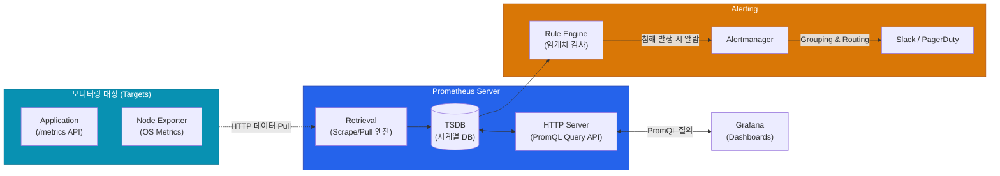

현대 클라우드 네이티브와 쿠버네티스 환경에서 가장 압도적인 점유율을 차지하는 모니터링 심장부는 **Prometheus(프로메테우스)**입니다. 왜 그토록 수많은 레거시 모니터링 도구를 몰아내고 업계 표준이 되었는지, 그 속을 들여다볼게요.

## Push가 아닌 Pull 모델의 선택

이전의 수많은 수집기는 에이전트가 중앙 서버로 자신의 상태를 던지는(Push) 방식이었습니다. 하지만 프로메테우스는 반대로 중앙 수집기가 주기적으로 타깃에 직접 접속해 데이터를 빨아옵니다(Pull).

| 방식 비교 | Push 모델 (e.g. InfluxDB, Datadog) | Pull 모델 (Prometheus) |
|---|---|---|
| **설정의 주체** | 수많은 에이전트 쪽에 서버 주소를 다 적어줘야 함 | **서버(Prom)가 어딜 긁어올지 리스트업**(Service Discovery 연동)해둠 |
| **장애 파악** | 안 보내면 얘가 죽은 건지 통신 문제인지 모름 | **내가 긁으러 갔는데 응답이 없네? "Target Down!"** (즉각 파악) |
| **방화벽 등** | 아웃바운드 포트만 뚫려 있으면 됨 | 프로메테우스가 각 엔드포인트에 닿는 인바운드 통신이 필요함 (보호망 내에서 쓰기 적합) |

이러한 Pull 방식은 서버가 동적으로 생성/소멸하는 쿠버네티스의 API(Service Discovery)와 궁합이 환상적입니다. 덕분에 "가서 긁어오라"는 선언형 파일(`ServiceMonitor`/`PodMonitor`) 하나만 던져두면 모니터링 대상 구성을 자동화할 수 있어요.

## Prometheus 생태계 아키텍처

하나의 도구가 아니라 여러 컴포넌트가 모여 거대한 파이프라인을 이룹니다.

1. **Exporters (수집기)**: MySQL, Redis, OS 내부에 붙어서 데이터를 프로메테우스가 읽기 편한 포맷으로 변환해 `/metrics` 엔드포인트로 노출시켜줘요.
2. **TSDB (시계열 데이터베이스)**: `(지표명, 시간, 수치 값)`이라는 간결한 압축 데이터만 초당 수십만 개씩 밀어 넣는 데 특화된 내부 고속 저장소예요.
3. **Alertmanager**: 중복된 에러들이 막 쏟아질 때 이거 다 슬랙으로 보내면 폭탄이 돼요. Alertmanager가 똑같은 500에러 10개를 1개의 묶음(Grouping)으로 이쁘게 포장해서 중복 발송을 막아줍니다.

## PromQL: 차원을 다루는 마법의 언어

일반적인 SQL이 2차원 테이블을 쿼리한다면, **PromQL(Prometheus Query Language)**은 시간과 꼬리표(라벨)라는 다차원 벡터(Vector)를 쿼리합니다. 처음엔 낯설어도 집계 효율은 엄청납니다.

- **현재 찰칵 (Instant Vector)**: `http_requests_total{status="500"}`
- **과거 5분 구간 기록 (Range Vector)**: `http_requests_total{status="500"}[5m]`
- **가장 많이 쓰는 형태 (Rate 연산)**: `sum(rate(http_requests_total[5m])) by (method)`
  - 해석: "최근 5분간의 요청 로그를 가져와 초당 증가율(rate) 기울기를 구하고, 그걸 API method 조건별로 총합(sum) 묶어줘!"

  
가장 취약한 고리: 단일 노드의 한계와 해결책

  기본 프로메테우스 뼈대는 데이터를 하나의 노드 로컬 디스크(TSDB)에만 저장합니다. 회사가 커지면서 수평 확장성(Clustering)과 몇 년 전 과거 기록 보관(Long-term Storage) 니즈가 생기면 구조적 한계에 부딪힙니다. 이를 해결하기 위해 엔터프라이즈 환경에서는 <strong>Thanos(타노스)</strong>나 <strong>Cortex/Mimir</strong> 같은 클러스터 연합 아키텍처를 뒤에 덧대어 사용합니다.

## 정리

- 프로메테우스는 에이전트 설정 번거로움과 타깃 생사 여부 즉각 파악을 위해 **HTTP Pull 아키텍처**를 채택했습니다.
- RDBMS로는 엄두도 못 낼 초당 쓰기 성능을 위해 로컬 **TSDB**를 직접 구현해 사용해요.
- 중복된 수백 개의 알람은 폭탄이 되지 않도록 반드시 **Alertmanager**를 거쳐 정제 후 발송합니다.
- 다차원 시계열 데이터의 그룹 연산과 초당 처리율 계산을 위해 설계된 언어, **PromQL**은 마스터해야 할 필수 스킬입니다.

데이터가 아름답게 모였다면, 다음 단계는 이 숫자들을 사용자에게 한눈에 이해시키는 것입니다. 대시보드의 대명사, **Grafana의 설계 원칙**을 다음 글에서 이어갈게요.
