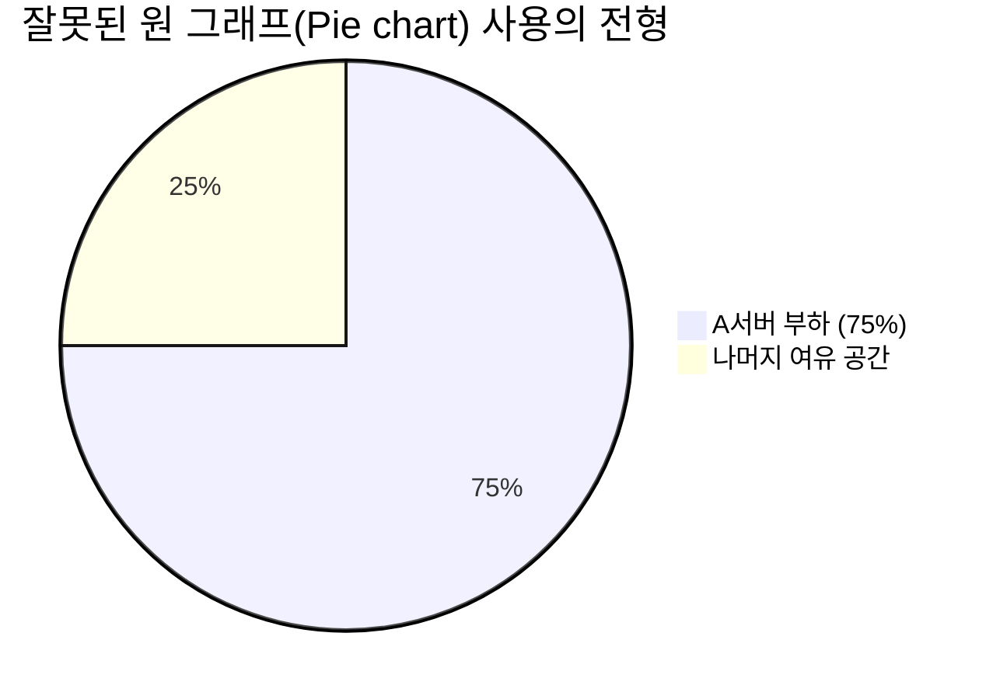

아무리 촘촘하게 메트릭을 수집하고 PromQL을 잘 짜서 뽑아내도, 장애 상황에서 모니터를 쳐다보는 엔지니어가 "대체 이게 무슨 뜻인데?" 하고 헤맨다면 실패한 모니터링입니다 

그라파나(Grafana)는 자유도가 엄청나게 높은 데이터 시각화 도구지만, 그 장점이 오히려 **'가독성 제로의 복잡한 콕핏(Cockpit)'**을 만드는 부작용 낳곤 합니다. 잘 읽히는 대시보드를 설계하는 UX 엔지니어링 팁을 짚어볼게요

## 계층적 시각화: Overview에서 Detail로

하나의 거대한 대시보드 페이지에 노드 상태, API 에러율, 디스크 용량, DB 커넥션 풀을 다 구겨 넣으면 시선이 분산됩니다. 좋은 대시보드는 **계층(드릴다운)**을 형성해야 합니다

1. **Level 1 (Executive Summary)**: 전체 서비스의 4가지 주요 상태(Golden Signals)만 볼드하게 박아놓은 최상단 요약 페이지. (정상/주의/경고 색깔만 봐도 상황 파악 완료)
2. **Level 2 (Service Specifics)**: "왜 장바구니 API에서 500 에러가 뜨지?"를 파헤치는 마이크로서비스 전용 보드 
3. **Level 3 (Infra / DB Detail)**: "API가 느린 이유 가 DB였네? 어느 노드의 디스크 I/O가 터진 걸까?"를 파악하는 노드 단위의 비재사용성 파편화 로우 레벨 모니터

## 그래프 유형별 올바른 사용법

수많은 패널 종류 중 가장 자주 쓰이는 시각화의 적절한 용도를 익혀두세요

| 시각화 타입 | 올바른 용례 | 피해야 할 안티 패턴 |
|---|---|---|
| **Stat / Guage** | 현재의 CPU %, 활성 유저 수, DB 동시 접속 수처럼 **가장 중요한 '현재 단일 값'**을 강조 | "지난주 평균값" 등 의미가 희미한 과거 값에 집착해 공간 낭비 |
| **Time Series (꺾은선)** | 트래픽 추이, Latency 변화 등 **시간 흐름에 따른 변동성(Trend)** 파악용도 | 10개가 넘는 라인을 한 차트에 겹쳐 알아볼 수 없는 스파게티 지옥 생성 |
| **Bar / 히스토그램** | 구역별, 트래픽 라우팅 비율, 에러 코드별(200 vs 500) 빈도를 **직관적 비중**으로 비교 | 시간 순서 추이가 가장 중요한 지표에 꺾은선 대신 억지로 세로 막대기 사용 |
| **Heatmap** | Histogram 처럼 P99 지연 시간분포 쏠림 현상을 **색상 농도 변화**로 뭉뚱그려 패턴 파악 | 하나하나의 정확한 수치를 핀포인트로 읽어야 하는 정밀 데이터에 도입 |

*(참고: 인간의 눈은 각도나 원의 면적을 구별하는 데 쥐약입니다. 비율을 나누어 보여주고 싶을 땐 파이차트보단 차라리 Bar 게이지나 선형 퍼센트 스택 바 레이아웃이 훨씬 직관적입니다.)*

## 템플릿 변수(Variables)를 통한 횡적 유연성

서버 50대 각각의 대시보드를 따로 만들 순 없겠죠
그라파나 상단의 드롭다운 필터인 **Variables**를 잘 설계해야 합니다. PromQL 쿼리에서 `$cluster`, `$namespace`, `$pod` 같은 변수를 치환하도록 구성해서, 메뉴 선택 한 번으로 화면 전체의 그래프 맥락(Context)이 전환되게 만들어야 해요

  
Dashboard as Code (JSON / Grafonnet)의 시대

  마우스로 화면을 드래그해서 하나하나 이쁘게 그린 대시보드는 "누가 이거 잘못 지웠는데 이력 복구 안 되나요?" 라는 한탄을 결국 낳습니다. 그라파나의 대시보드 뒷모습은 사실 복잡한 <strong>JSON 텍스트 덩어리</strong>예요. 이를 깃허브 버전에 코드로 저장해 K8s ConfigMap이나 CD 툴로 언제든 일관되게 자동 배포(Provisioning)하는 코드화를 이루어야 실수나 장비 마비로부터 안전합니다. (Jsonnet이나 Terraform 모듈을 적극 활용해 보세요.)

## 정리

- 대시보드는 소설책처럼 **위에서 아래로, 넓은 범위에서 좁은 원인으로(Overview → Detail)** 시선이 흐르도록 논리적 배치를 갖춰야 합니다
- **꺾은선 그래프(Time Series)**에 너무 많은 범례 항목을 던져 넣어 스파게티 차트를 만드는 과적을 극도로 경계하세요
- 각 서비스와 인스턴스를 손쉽게 전환할 수 있게 상단 **템플릿 변수(Variables)**를 반드시 뚫어두세요
- 마우스 클릭 질로 만든 대시보드도 종착지는 **JSON 코드(Dashboard as Code)**로 덤프를 떠 원격 형상 관리 도구에 커밋해야 합니다

이제 직관적인 계기판 시청각 인프라가 잡혔습니다. 마지막으로, 시스템 폭주 중 운영자가 퇴근 뒤 멱살을 잡히며 잠에서 깨지 않으려면 <strong>"어떤 기준으로 알람(Alert)"</strong>을 걸어 동료를 보호해야 할지, **SLO와 Error Budget 원칙**을 알아보겠습니다
