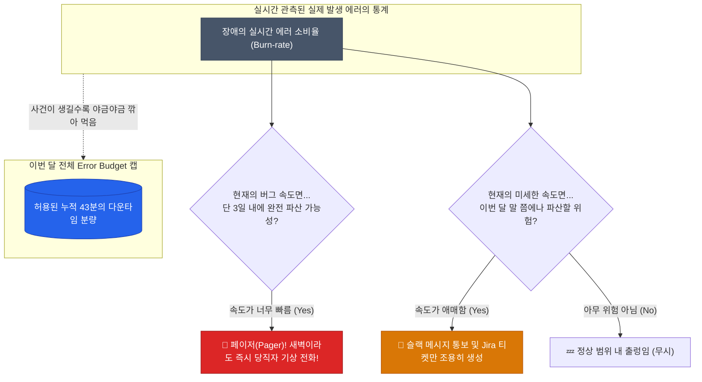

"CPU 사용률 80% 돌파! 서버 메모리 85% 임박!"  
수시로 울리는 스마트폰 슬랙 알람 메시지의 홍수 속에서 개발자들은 점차 알람을 '무시(Mute)'하게 됩니다. 이것이 가장 치명적인 인재를 뒤늦게 부르는 **알람 피로도(Alert Fatigue)** 예요

디비 서버의 CPU가 90%를 찍는다고 당장 회사가 망할까요? 만약 고객 앱 화면에 체감되는 장애가 없다면, 피곤한 엔지니어를 굳이 새벽 3시에 깨워선 안 됩니다. 이를 해결하고자 구글 SRE 조직이 주창한 **SLO와 Error Budget** 혁신 개념이 등장했어요

## 모호한 약속을 수치로: SLI / SLO / SLA

1. **SLI (Service Level Indicator, 지표 측정 기준)**
   "고객이 체감하는 품질을 무슨 기준으로 잴 건가?" 
   (예: `전체 HTTP 요청 중 명시적 실패(500 서버 에러)가 아닌 통과 비율`, `모든 트래픽 중 응답시간 500ms 안에 처리된 건의 비율`)
   
2. **SLO (Service Level Objective, 내부 약속 목표)**
   "그 채택한 신뢰성 지표를 우리 엔지니어링 팀은 월 기준 몇 퍼센트까지 달성할 건가?" 
   (예: `이번 11월 한 달 동안 성공률 SLI가 99.9%를 유지할 것`) 
   - *주의: 여기서 100% 가동률을 목표로 잡는 건 가장 미련한 짓입니다. 100%를 지키려면 인프라 이중화 낭비와 신규 기능 배포 무기한 취소라는 엄청난 기회비용과 족쇄가 생겨요.*
   
3. **SLA (Service Level Agreement, 외부 고객 배상 계약)**
   "만약 위 목표를 못 지키면 돈(청구서 크레딧 환불)을 얼마나 토해낼 건가?" 
   (이는 기술 영역에 비즈니스 및 영업 팀의 영역이 섞인 최종 약관입니다.)

현장 엔지니어링 팀이 쳐다봐야 하는 북극성은 오직 **SLO(우리의 가변적 자체 목표치)**뿐입니다 

## Error Budget (에러 예산 측정)의 개념

이번 달 목표치인 SLO가 `99.9%`라고 치면, 나머지 전체 한 달 로그의 `0.1%` (시간으로 치면 대충 43분 언저리) 정도는 **"사용자가 조금 장애 빡침을 겪어도 회사 공식적으로 눈감아주는(허용 가능한) 다운타임 잉여 구간"**이 계산되어 나옵니다 

이 소금 같은 잉여 시간을 바로 **Error Budget(장애 발생 예산)**이라고 부릅니다

- **예산이 아주 빵빵함**: "어라, 이번 한 주는 시스템이 너무 평온하고 안정적이네? 에러 예산 남을 텐데, 겁내지 말고 맘껏 신규 배포하고 장애 실험도 좀 돌려보자!"
- **예산 파산 경고등**: "이번 달 초에 디비 마이그레이션 터져서 이미 예산을 90% 다 태워먹었네 🚨. 남은 3주간은 신규 피쳐 배포 전면 동결이다! 기술 부채 청산과 안정화 작업에만 올인해라!"

이처럼 추상적인 비즈니스 배포 일정을 **'감'**이 아닌 잔존 수치 기반 예산으로 합의하게 만드는 위력적인 마법 도구가 버짓입니다

## Burn-rate 기반의 모던 알람 전략 (진짜 깰 타이밍)

과거엔 `CPU 80% 넘으면 무조건 슬랙 핑` 룰을 걸었다면, 이제 모던 플랫폼실에서의 알람 트리거 기준은 오직 하나입니다 
**"Error Budget 예산이 태워지는(Burn) 속도가 너무 비정상적으로 빠릅니다, 이 속도면 수일 내로 예산 한도가 파산(SLO 붕괴)하겠는데요!?"**

구글은 이를 **Multi-window, Multi-burn-rate (다중 윈도우 다중 오류 소진 속도) 알람 모델**로 정교화했습니다
- 지난 1시간 동안 미친 듯이 연쇄 타임아웃 500 에러가 발생해서 예산이 순삭 중이라면 **→ 심야 페이저(Pager/전화) 알람 강제 타격**
- 아주 미세한 DB 병목 지연이 3일간 천천히 누수되고 있어도 급한 불은 아니면 **→ 출근 후 티타임 하며 한가롭게 확인 가능한 지라(Jira) 티켓 백로그 신규 생성**

  
가장 중요한 철학: 증상(Symptom) 알람 vs 원인(Cause) 알람

  시스템 파티션 디스크가 95% 가득 찼거나 JVM GC 사이클로 인해 CPU가 높은 건 단지 장애 발생 가능성의 <strong>원인(Cause)</strong> 지표일 뿐, 아직 실제로 고객 프론트엔드 모바일 앱이 에러를 토해냈다는 증거는 절대 아닙니다. 반면 타임아웃이 발생해 실 고객 결제가 드랍되어 흰 화면을 보는 건 <strong>증상(Symptom)</strong>의 결과치입니다. 주말에 곤히 잠든 인프라 동료를 무자비하게 깨워도 욕 안 먹을 유일한 정당한 알람은 오직 '고객의 체감 속도와 SLO 지표를 직접 위협하는 증상 알람'뿐이어야 합니다

## 정리 요약

- 인프라 리소스 한계치(퍼센트 임계치) 기반의 무지성 고전적 알람 체계는 운영자의 피로와 번아웃만 가중시킵니다
- 유저 경험을 최전방에서 대변하는 척도를 모아 **SLI** 잣대를 정하고, 한 달간 지켜야만 하는 보수적 목표치 **SLO**를 부서끼리 합의하세요
- SLO 기준선에서 마이너스 시킨 여유 잉여 영역(합법적인 장애 허용 시간)을 **Error Budget(장애 예산)**으로 무기 삼아 개발팀의 배포 빈도 속도를 강제로 조절하는 브레이크 페달로 쓰세요
- 당장 에러 예산이 파산할 위험(Burn-rate 초과 등급)이 감지될 때만 새벽 전화(Pager) 알람을 울리게 설계하여 인프라 팀을 고도화하세요

길었던 측정과 로깅의 **`Observability`** 챕터 하위 모니터링 파트가 완전히 끝났습니다. 우리가 서버에서 밤낮없이 모은 지표는 차트 그리기 놀이가 아니라, SRE(사이트 신뢰성 엔지니어링)를 향한 절대적인 조직의 공용 길잡이입니다
