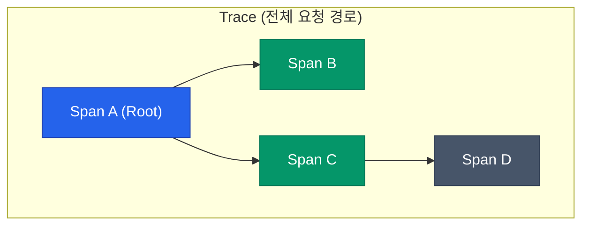
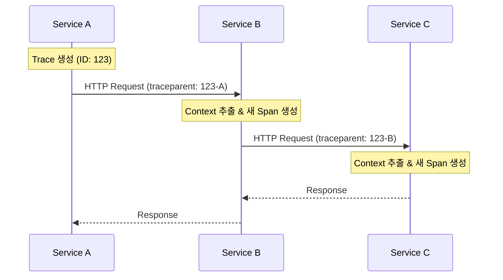

마이크로서비스 아키텍처(MSA)에서는 하나의 사용자 요청이 수십 개의 서비스를 거쳐 처리되곤 합니다. 어느 한 곳에서 지연이나 에러가 발생했을 때, 로그만으로는 "정확히 어디서, 왜" 문제가 생겼는지 파악하기 어렵습니다. 각 서비스의 로그는 흩어져 있고 서로 연결되어 있지 않기 때문입니다. **분산 추적(Distributed Tracing)**은 이 파편화된 요청의 경로를 하나의 실타래로 꿰어주는 기술입니다.

## 핵심 개념: Trace와 Span

분산 추적을 이해하는 가장 기본 단위는 **Trace**와 **Span**입니다.



| 개념 | 설명 |
|---|---|
| **Trace** | 사용자가 시스템에 보낸 하나의 전체 요청 흐름입니다. 고유한 `Trace ID`를 가집니다. |
| **Span** | Trace를 구성하는 작업의 최소 단위입니다. 특정 서비스에서의 함수 호출, DB 쿼리 등이 하나의 Span이 됩니다. |
| **Parent-Child** | Span 사이의 인과 관계입니다. A 서비스가 B 서비스를 호출하면, A의 Span은 B Span의 부모가 됩니다. |

하나의 Trace는 트리 구조(Directed Acyclic Graph)를 형성하며, 각 Span은 시작/종료 시간, 작업 이름, 그리고 실행 결과 상태(Tag/Attribute)를 담고 있습니다.

## 문맥 전달: Context Propagation

서로 다른 서버에 있는 서비스들이 어떻게 "우리가 같은 Trace에 속해 있다"는 것을 알 수 있을까요? 요청을 보낼 때 HTTP 헤더 등에 추적 정보를 실어 보내는 **Context Propagation** 덕분입니다.



과거에는 Jaeger(Uber-Trace-Id)나 Zipkin(B3 Propagation) 등 벤더마다 헤더 형식이 달랐지만, 지금은 **W3C Trace Context** 표준으로 통합되는 추세입니다.

```bash
# W3C Trace Context 표준 헤더 예시
traceparent: 00-4bf92f3577b34da6a3ce929d0e0e4736-00f067aa0ba902b7-01
# [Version]-[Trace ID]-[Parent Span ID]-[Flags]
```

## 시각화의 힘: Gantt Chart와 Service Map

수집된 데이터는 보통 두 가지 방식으로 시각화되어 운영자에게 통찰을 줍니다.

### 1. 타임라인 (Gantt Chart)
특정 요청이 각 구간에서 얼마나 시간을 썼는지 보여줍니다. 병목 구간을 찾을 때 가장 유용합니다.

```mermaid
gantt
    title 요청 처리 타임라인 (Trace View)
    dateFormat  X
    axisFormat %s
    section API Gateway
    Span A (Root)      :a1, 0, 100
    section Order Service
    Span B (Auth)      :a2, 5, 20
    Span C (Logic)     :a3, 25, 80
    section DB
    Span D (Query)     :a4, 40, 70
```



### 2. 서비스 맵 (Service Map)
시스템 전체의 의존 관계와 트래픽 흐름을 한눈에 보여줍니다. 특정 구간의 에러율이나 응답 시간을 시각적으로 표현합니다.

| 시각화 | 용도 | 핵심 지표 |
|---|---|---|
| **Trace View** | 개별 요청 디버깅 | Latency, Span 구조 |
| **Service Map** | 시스템 전반 모니터링 | Error Rate, Throughput |

## 샘플링의 필요성

모든 요청을 추적하면 좋겠지만, 트래픽이 많은 시스템에서는 추적 데이터 자체가 인프라에 부담(스토리지 비용, 네트워크 오버헤드)을 줄 수 있습니다. 그래서 보통 **Sampling**을 적용합니다.

- **Head-based Sampling**: 요청이 시작될 때 추적 여부를 결정합니다. 구현이 쉽지만 에러가 난 중요한 요청을 놓칠 수 있습니다.
- **Tail-based Sampling**: 모든 요청을 수집한 뒤, 에러가 발생했거나 지연이 심한 요청만 선별해서 저장합니다.

<div class="callout why">
  <div class="callout-title">로그(Log)와 트레이스(Trace)의 차이</div>
  로그가 "특정 시점에 어떤 일이 일어났는가"를 기록하는 <b>점(Point)</b>의 정보라면, 트레이스는 "요청이 어떻게 흘러갔는가"를 기록하는 <b>선(Line)</b>의 정보입니다. 분산 추적 시스템은 Span에 로그(Event/Annotation)를 연결하여, 특정 구간의 상세 맥락을 파악할 수 있게 해줍니다.
</div>

## 정리

- **Trace**는 요청의 전체 경로, **Span**은 그 경로 속 작업 단위입니다.
- **Context Propagation**을 통해 여러 서비스 사이의 추적 정보를 연결합니다.
- **W3C Trace Context**가 표준 헤더 형식으로 자리 잡고 있습니다.
- Gantt 차트와 Service Map을 통해 병목 지점을 시각적으로 진단합니다.

다음 글에서는 이 분산 추적 데이터를 특정 벤더에 종속되지 않고 수집할 수 있게 해주는 표준 도구, **OpenTelemetry**의 구조를 살펴봅니다.
