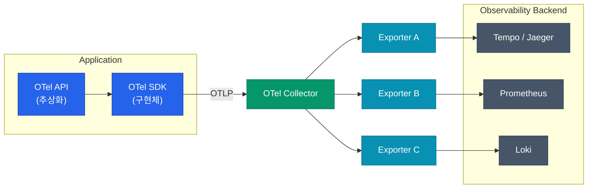
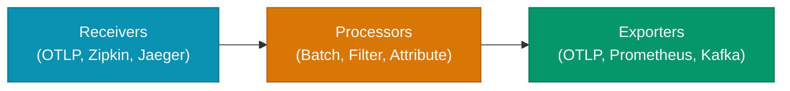

관측성(Observability) 데이터를 수집할 때 가장 큰 고민은 벤더 종속성(Vendor Lock-in)입니다. 특정 모니터링 도구의 라이브러리를 코드에 심으면, 나중에 도구를 바꿀 때 코드 전체를 수정해야 하기 때문입니다. **OpenTelemetry(OTel)**는 이 문제를 해결하기 위해 데이터 수집 표준을 제공하는 오픈소스 프레임워크입니다.

## OTel의 세 축: API, SDK, Collector

OpenTelemetry는 단순히 하나의 도구가 아니라, 데이터 생성부터 전송까지를 담당하는 여러 컴포넌트의 집합입니다.



| 컴포넌트 | 역할 |
|---|---|
| **API** | 데이터를 생성하기 위한 추상화 계층입니다. 코드에는 이 API만 노출됩니다. |
| **SDK** | API의 실제 구현체입니다. 샘플링, 데이터 가공, 전송 방식 등을 설정합니다. |
| **Collector** | 데이터를 받아서(Receive), 처리하고(Process), 내보내는(Export) 독립 실행형 서비스입니다. |

## 인스트루멘테이션(Instrumentation) 방식

코드에 OTel을 적용하는 방식은 자동과 수동으로 나뉩니다.

| 방식 | 설명 | 장점 | 단점 |
|---|---|---|---|
| **Auto** | 에이전트나 라이브러리가 프레임워크 호출을 가로채 자동으로 Span을 생성합니다. | 코드 수정 최소화, 빠른 도입 | 세밀한 비즈니스 로직 추적 어려움 |
| **Manual** | 개발자가 직접 API를 호출하여 필요한 구간에 Span을 생성합니다. | 명확한 의도 파악, 상세한 데이터 | 개발 공수 발생, 코드 오염 가능성 |

실무에서는 **Auto Instrumentation**으로 전체적인 흐름을 먼저 잡고, 중요한 비즈니스 로직에만 **Manual Instrumentation**을 추가하는 방식을 권장합니다.

## Collector 파이프라인 구조

Collector는 OTel의 꽃입니다. 데이터가 거쳐가는 파이프라인을 YAML 설정만으로 유연하게 구성할 수 있습니다.



1. **Receivers**: 다양한 포맷의 데이터를 받아들입니다.
2. **Processors**: 데이터를 묶어서 보내거나(Batch), 태그를 추가/삭제하고, 불필요한 데이터를 필터링합니다.
3. **Exporters**: 처리된 데이터를 최종 백엔드(Grafana Tempo, Honeycomb 등)로 보냅니다.

<div class="callout why">
  <div class="callout-title">핵심 인사이트: Collector를 써야 하는 이유</div>
  애플리케이션이 백엔드로 직접 데이터를 보내면 백엔드 장애 시 앱에 영향을 줄 수 있고, 전송 로직이 앱의 리소스를 소모합니다. <b>Collector</b>를 중간에 두면 앱은 가장 가까운 Collector로 빠르게 데이터를 던지고 잊어버릴 수 있으며, 벤더를 바꿀 때도 Collector 설정만 바꾸면 됩니다.
</div>

## OTLP 프로토콜

OpenTelemetry는 **OTLP(OpenTelemetry Line Protocol)**라는 전용 프로토콜을 사용합니다. gRPC나 HTTP/JSON 기반으로 동작하며, 메트릭·로그·트레이스를 모두 하나의 프로토콜로 처리할 수 있어 효율적입니다.

```yaml
# Collector 설정 예시 (추출)
receivers:
  otlp:
    protocols:
      grpc:
      http:

processors:
  batch:

exporters:
  otlp/tempo:
    endpoint: "tempo:4317"
    tls:
      insecure: true

service:
  pipelines:
    traces:
      receivers: [otlp]
      processors: [batch]
      exporters: [otlp/tempo]
```

## 정리

- **OpenTelemetry**는 관측성 데이터 수집의 표준을 제공하여 벤더 종속성을 제거합니다.
- **API/SDK**를 통해 데이터를 생성하고, **Collector**를 통해 가공 및 전송합니다.
- **Auto Instrumentation**은 빠른 시작을, **Manual**은 정밀한 추적을 돕습니다.
- **Collector 파이프라인**을 통해 복잡한 데이터 흐름을 중앙에서 제어합니다.

다음 글에서는 트레이스 데이터의 양을 조절하여 비용과 효율을 관리하는 **샘플링 전략**을 다룹니다.
