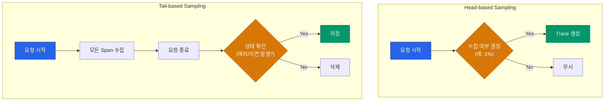
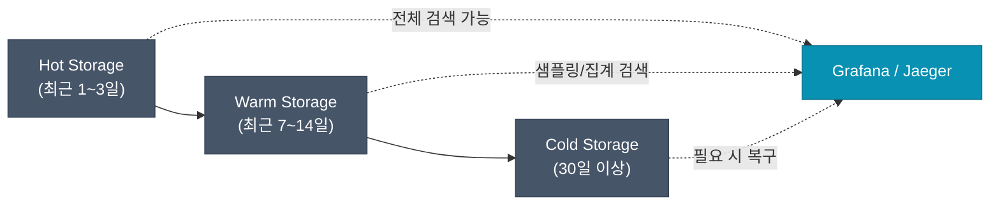

분산 추적 시스템을 운영할 때 가장 큰 도전 과제는 데이터의 양입니다. 모든 요청을 100% 수집하면 완벽한 가시성을 얻을 수 있지만, 스토리지 비용과 네트워크 대역폭 소모가 기하급수적으로 늘어납니다. 따라서 프로덕션 환경에서는 의미 있는 데이터만 골라내는 **샘플링(Sampling)** 전략이 필수입니다.

## 샘플링의 두 지점: Head vs Tail

샘플링은 결정이 내려지는 시점에 따라 크게 두 가지로 나뉩니다.

### 1. Head-based Sampling
요청이 서비스에 진입하는 시점에 수집 여부를 결정합니다.
- **장점**: 구현이 매우 단순하고, 수집하지 않기로 한 데이터는 네트워크를 타지 않아 오버헤드가 적습니다.
- **단점**: "랜덤"하게 뽑기 때문에, 정말 중요한 **에러 발생 요청**이나 **비정상적으로 느린 요청**이 누락될 확률이 높습니다.

### 2. Tail-based Sampling
요청이 모두 끝난 뒤, 전체 Trace의 내용을 보고 저장 여부를 결정합니다.
- **장점**: 에러가 발생했거나 특정 임계치보다 느린 요청만 100% 수집하는 등 영리한 결정이 가능합니다.
- **단점**: 결정을 내리기 전까지 모든 데이터를 메모리나 임시 저장소에 들고 있어야 하므로 Collector 계층의 리소스 소모가 큽니다.

## 프로덕션 샘플링 전략 패턴

실무에서는 비용과 가시성의 균형을 맞추기 위해 여러 기법을 혼합합니다.

| 전략 | 설명 | 적용 사례 |
|---|---|---|
| **Probabilistic** | 고정된 확률(예: 0.1%)로 수집합니다. | 트래픽이 매우 많은 안정적인 서비스 |
| **Rate Limiting** | 초당 최대 수집 개수를 제한합니다. | 갑작스러운 트래픽 폭주 시 시스템 보호 |
| **Adaptive** | 트래픽 양에 따라 샘플링 비율을 자동으로 조절합니다. | 서비스별 트래픽 편차가 큰 환경 |
| **Attribute-based** | 특정 URL, 사용자 ID, HTTP 메서드에 따라 비율을 달리합니다. | 결제 등 중요한 API는 100% 수집 |

## 관측성 데이터의 생애주기와 비용

트레이스 데이터는 시간이 지날수록 가치가 급격히 떨어집니다. 이를 고려한 계층화 저장 전략이 필요합니다.

- **최근 데이터**: SSD 기반의 빠른 스토리지(Tempo, Elasticsearch)에 저장하여 즉각적인 장애 대응에 활용합니다.
- **과거 데이터**: S3 같은 저렴한 오브젝트 스토리지로 넘기거나, 요약된 메트릭 데이터만 남기고 원본 트레이스는 삭제합니다.

  
핵심 인사이트: "모든 것을 보려 하지 마세요"

  분산 추적의 목적은 모든 요청의 기록이 아니라, <b>시스템의 비정상적인 동작을 진단</b>하는 것입니다. 99%의 정상 요청보다는 1%의 에러와 5%의 지연 요청을 찾는 데 집중하는 샘플링 정책이 가장 효율적입니다.

## 운영 시 고려사항

1. **Context Propagation 유지**: 샘플링되지 않는 요청이라도 `Trace ID`는 다음 서비스로 전달되어야 합니다. 그래야 로그와 트레이스를 연결할 수 있습니다.
2. **Collector 메모리 관리**: Tail-based 샘플링을 사용할 경우, 처리 중인 Span이 메모리에 쌓이므로 Collector의 리소스 모니터링이 필수입니다.
3. **사용자 식별**: PII(개인정보)가 포함되지 않도록 Span Attribute에서 민감 정보를 필터링하는 로직을 Collector Processor에 추가해야 합니다.

## 정리

- **샘플링**은 시스템 부하와 비용 관리를 위한 필수 전략입니다.
- **Head-based**는 가볍고 단순하며, **Tail-based**는 정교하고 강력합니다.
- 중요도에 따라 **Attribute-based** 샘플링을 혼합하여 핵심 데이터 유실을 방지합니다.
- 데이터의 가치에 따라 **저장 계층**을 분리하여 운영 비용을 최적화합니다.

Tracing 시리즈를 통해 분산 추적의 개념부터 표준 도구인 OpenTelemetry, 그리고 실전 운영 전략까지 살펴보았습니다. 인프라가 복잡해질수록 이러한 도구들이 주는 확신은 더욱 값진 자산이 될 것입니다.
